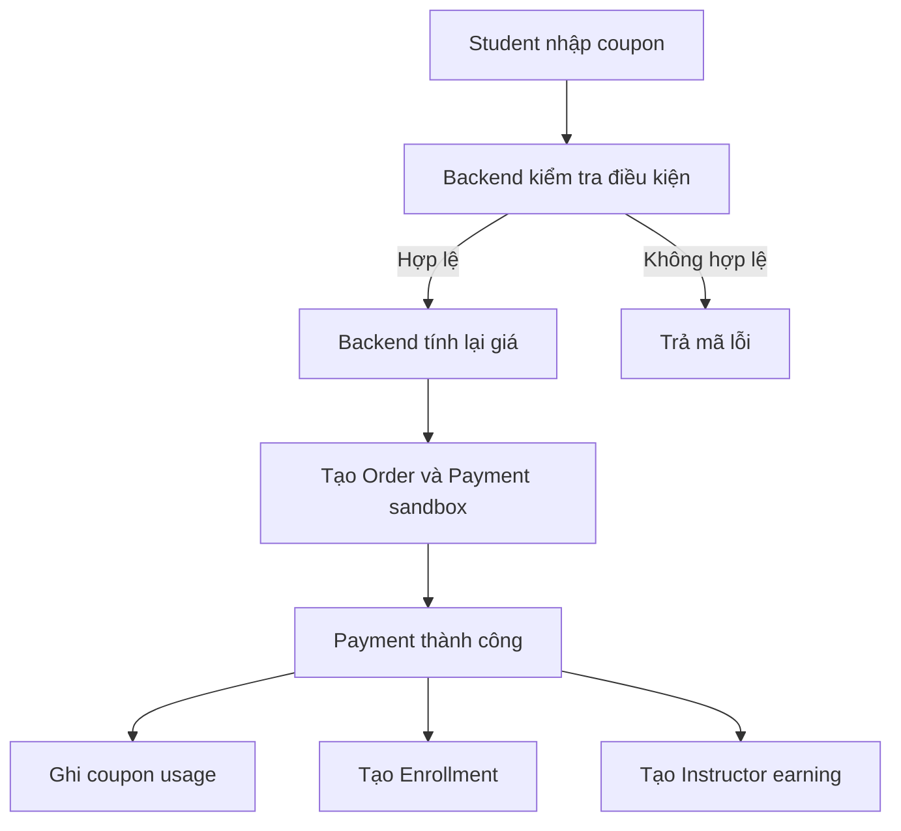
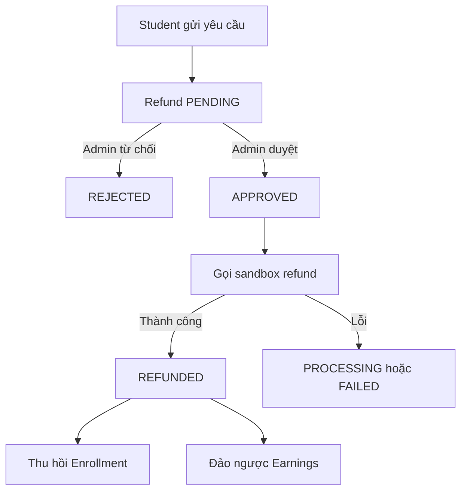
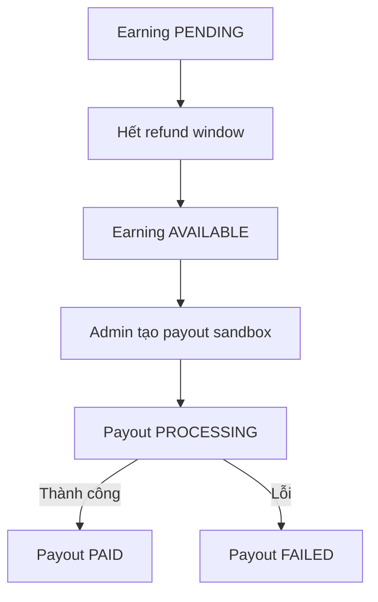

gg# Sprint 10 — Coupon, hoàn tiền và doanh thu

> Dự án: LMS Platform  
> Nhân sự đề xuất: 01 Backend + 01 Frontend  
> Thời lượng đề xuất: 07–10 ngày làm việc  
> Môi trường thanh toán: Sandbox, không xử lý tiền thật  
> Công nghệ: ExpressJS, TypeScript, Prisma, PostgreSQL, Vue 3, Pinia, Tailwind CSS

## 1. Mục tiêu Sprint

Sprint 10 mở rộng Payment thành một module thương mại hoàn chỉnh hơn, gồm:

- Admin quản lý coupon.
- Student áp dụng coupon khi mua khóa học.
- Student gửi yêu cầu hoàn tiền.
- Admin duyệt hoặc từ chối yêu cầu hoàn tiền.
- Hệ thống cập nhật Payment, Order và quyền truy cập nhất quán.
- Hệ thống tính doanh thu gộp, phí nền tảng và thu nhập giảng viên.
- Admin quản lý payout giả lập cho Instructor.
- Student và Instructor xem được lịch sử liên quan trên giao diện.

## 2. Phạm vi MVP

### 2.1. Coupon

- Giảm theo phần trăm.
- Giảm một số tiền cố định.
- Ngày bắt đầu và hết hạn.
- Giới hạn tổng số lượt sử dụng.
- Chỉ áp dụng cho một số khóa học hoặc toàn bộ khóa học.
- Mỗi người chỉ được sử dụng một lần.
- Bật/tắt coupon.
- Kiểm tra và hiển thị số tiền giảm trước khi checkout.

### 2.2. Refund

- Student gửi yêu cầu hoàn tiền.
- Student xem trạng thái yêu cầu.
- Admin xem danh sách yêu cầu.
- Admin duyệt hoặc từ chối và ghi lý do.
- Gọi payment sandbox để giả lập refund.
- Cập nhật Payment, Order, Enrollment và Earnings bằng transaction.
- Thu hồi quyền truy cập khi refund thành công.

### 2.3. Instructor revenue

- Doanh thu gộp.
- Phí nền tảng.
- Doanh thu thực nhận.
- Thu nhập đang chờ, khả dụng, đã thanh toán và bị đảo ngược.
- Lịch sử payout giả lập.
- Chi tiết doanh thu theo khóa học.

### 2.4. Chưa làm trong Sprint 10

- Thanh toán và payout tiền thật.
- KYC giảng viên.
- Thuế, hóa đơn điện tử và đối soát ngân hàng.
- Coupon cộng dồn nhiều mã.
- Coupon theo nhóm người dùng phức tạp.
- Tự động phát hiện gian lận bằng Machine Learning.
- Partial refund nhiều lần nếu payment provider chưa hỗ trợ.
- Chargeback/dispute từ ngân hàng.

## 3. Nguyên tắc tài chính bắt buộc

1. Không dùng JavaScript floating-point để tính tiền.
2. Với VND, nên lưu số tiền bằng số nguyên `BIGINT` theo đơn vị đồng.
3. Nếu hỗ trợ tiền tệ có phần thập phân, dùng Prisma `Decimal` và quy tắc làm tròn rõ ràng.
4. Giá, discount, platform fee và instructor earning phải được snapshot lúc thanh toán.
5. Không tính lại order cũ theo giá hoặc tỷ lệ phí hiện tại.
6. Coupon chỉ được ghi nhận đã sử dụng sau khi payment thành công.
7. Mọi webhook và thao tác tài chính phải idempotent.
8. Refund và cập nhật quyền truy cập phải chạy theo state machine rõ ràng.
9. Không tin số tiền do Frontend gửi; Backend tự tính lại toàn bộ.
10. Không lưu thông tin thẻ trong database của LMS.

## 4. Vai trò và quyền

| Hành động | Student | Instructor | Admin |
|---|:---:|:---:|:---:|
| Nhập và kiểm tra coupon | Có | Không | Có thể test |
| Xem coupon nội bộ | Không | Có thể xem coupon course của mình nếu mở rộng | Có |
| Tạo/sửa/tắt coupon | Không | Không trong MVP | Có |
| Gửi refund request | Có | Không | Không |
| Xem refund của chính mình | Có | Không | Có |
| Duyệt/từ chối refund | Không | Không | Có |
| Xem doanh thu của chính mình | Không | Có | Có |
| Tạo payout sandbox | Không | Không | Có |
| Xem payout của chính mình | Không | Có | Có |

## 5. Luồng nghiệp vụ tổng quát

### 5.1. Áp dụng coupon và thanh toán



### 5.2. Refund



### 5.3. Payout Instructor



## 6. Quy tắc nghiệp vụ Coupon

Coupon hợp lệ khi thỏa mãn tất cả điều kiện:

- `isActive = true`.
- Thời điểm hiện tại không trước `startsAt`.
- Thời điểm hiện tại không sau `expiresAt`.
- Chưa vượt `maxRedemptions` nếu có giới hạn.
- Student chưa sử dụng coupon này thành công.
- Course nằm trong phạm vi coupon.
- Giá trị order đạt `minOrderAmount` nếu có.
- Coupon không bị xóa hoặc vô hiệu hóa trong lúc checkout.

### 6.1. Coupon phần trăm

```text
discountAmount = floor(originalAmount × percentage / 100)
```

- `percentage` phải lớn hơn 0 và không vượt 100.
- Có thể thêm `maxDiscountAmount` để giới hạn số tiền giảm.

### 6.2. Coupon số tiền cố định

```text
discountAmount = min(fixedAmount, originalAmount)
```

Không cho `finalAmount` âm:

```text
finalAmount = max(originalAmount - discountAmount, 0)
```

### 6.3. Sử dụng coupon một lần

- Tạo unique constraint `(coupon_id, user_id)` trong `coupon_usages`.
- Chỉ tạo usage ở trạng thái `REDEEMED` khi payment thành công.
- Checkout chưa thanh toán có thể giữ coupon trong thời gian ngắn nếu cần, nhưng MVP có thể kiểm tra lại lúc payment callback.
- Việc kiểm tra giới hạn và tạo usage phải nằm trong transaction hoặc dùng atomic update để tránh vượt giới hạn khi nhiều người dùng cùng lúc.

## 7. Quy tắc nghiệp vụ Refund

### 7.1. Điều kiện gửi yêu cầu

- Payment đã thành công.
- Order thuộc Student đang đăng nhập.
- Chưa có refund request đang xử lý hoặc đã hoàn tiền cho payment đó.
- Vẫn nằm trong refund window, đề xuất 7 ngày từ lúc payment thành công.
- Nếu áp dụng chính sách học tập, progress chưa vượt ngưỡng, ví dụ 20%.
- Student nhập lý do.

Chính sách 7 ngày và 20% là cấu hình nghiệp vụ, không hard-code trong controller.

### 7.2. Trạng thái Refund Request

```ts
export enum RefundRequestStatus {
  PENDING = 'PENDING',
  APPROVED = 'APPROVED',
  REJECTED = 'REJECTED',
  PROCESSING = 'PROCESSING',
  REFUNDED = 'REFUNDED',
  FAILED = 'FAILED',
  CANCELLED = 'CANCELLED',
}
```

### 7.3. Thu hồi quyền truy cập

Khi refund thành công:

- Chuyển enrollment sang `REFUNDED` hoặc `REVOKED`.
- Student không được mở nội dung trả phí của khóa học.
- Không xóa lịch sử progress, quiz attempt hoặc certificate ngay khỏi database.
- Certificate đã cấp cần chuyển `REVOKED` nếu policy yêu cầu.
- Student vẫn xem được order/refund history.
- Coupon usage không tự động trả lại lượt trong MVP, trừ khi business rule quy định khác.

### 7.4. Tính nhất quán khi provider lỗi

- Không đánh dấu Payment `REFUNDED` trước khi sandbox/provider xác nhận.
- Nếu provider xử lý bất đồng bộ, lưu trạng thái `PROCESSING`.
- Webhook xác nhận mới hoàn tất refund, revoke access và reverse earnings.
- Retry webhook không được reverse earnings nhiều lần.

## 8. Quy tắc doanh thu Instructor

### 8.1. Công thức

```text
grossAmount = số tiền Student thực trả cho course
platformFee = floor(grossAmount × platformFeeRate / 100)
netAmount = grossAmount - platformFee
```

Ví dụ:

```text
Giá khóa học:       1.000.000 VND
Coupon:               200.000 VND
Student trả:           800.000 VND
Phí nền tảng 20%:      160.000 VND
Instructor nhận:       640.000 VND
```

Phí nền tảng được tính trên số tiền thực trả, không tính trên giá gốc, trừ khi dự án chọn chính sách khác.

### 8.2. Trạng thái earning

```ts
export enum EarningStatus {
  PENDING = 'PENDING',
  AVAILABLE = 'AVAILABLE',
  PAID = 'PAID',
  REVERSED = 'REVERSED',
}
```

- `PENDING`: payment thành công nhưng còn trong refund window.
- `AVAILABLE`: đã hết refund window và có thể payout.
- `PAID`: đã thuộc một payout thành công.
- `REVERSED`: payment đã refund; earning không còn được trả.

Nếu refund xảy ra sau khi payout đã `PAID`, hệ thống cần tạo số dư âm hoặc adjustment. Phần này có thể để Sprint 10.1; MVP chỉ cho refund trước khi earning được payout.

### 8.3. Payout sandbox

- Admin chọn Instructor và các earning `AVAILABLE`.
- Backend tính tổng payout, không nhận tổng tiền từ Frontend.
- Payout có mã tham chiếu giả lập.
- Khi payout thành công, earning chuyển `PAID`.
- Nếu payout thất bại, earning vẫn `AVAILABLE` để thử lại.

## 9. Thiết kế database

### 9.1. Bảng `coupons`

| Cột | Kiểu gợi ý | Bắt buộc | Mô tả |
|---|---|---:|---|
| `id` | UUID | Có | Khóa chính |
| `code` | VARCHAR(50) | Có | Unique, chuẩn hóa uppercase |
| `name` | VARCHAR(255) | Có | Tên nội bộ |
| `description` | TEXT | Không | Mô tả |
| `discount_type` | Enum | Có | `PERCENTAGE`, `FIXED_AMOUNT` |
| `discount_value` | BIGINT/DECIMAL | Có | Phần trăm hoặc số tiền |
| `max_discount_amount` | BIGINT/DECIMAL | Không | Trần giảm với percentage |
| `min_order_amount` | BIGINT/DECIMAL | Không | Giá trị order tối thiểu |
| `starts_at` | TIMESTAMP | Có | Ngày bắt đầu |
| `expires_at` | TIMESTAMP | Có | Ngày hết hạn |
| `max_redemptions` | INTEGER | Không | Tổng lượt tối đa |
| `redeemed_count` | INTEGER | Có | Counter hỗ trợ kiểm tra nhanh |
| `applies_to_all_courses` | BOOLEAN | Có | Áp dụng toàn bộ course |
| `is_active` | BOOLEAN | Có | Bật/tắt coupon |
| `created_by` | UUID | Có | Admin tạo |
| `created_at` | TIMESTAMP | Có | Thời điểm tạo |
| `updated_at` | TIMESTAMP | Có | Thời điểm cập nhật |

Constraint:

- Unique index trên code đã chuẩn hóa.
- `starts_at < expires_at`.
- `discount_value > 0`.
- Percentage không vượt 100.

### 9.2. Bảng `coupon_courses`

| Cột | Kiểu gợi ý | Bắt buộc | Mô tả |
|---|---|---:|---|
| `coupon_id` | UUID | Có | FK coupon |
| `course_id` | UUID | Có | FK course |
| `created_at` | TIMESTAMP | Có | Thời điểm thêm |

Primary key hoặc unique:

```text
(coupon_id, course_id)
```

Khi `applies_to_all_courses = true`, không cần thêm bản ghi vào `coupon_courses`.

### 9.3. Bảng `coupon_usages`

| Cột | Kiểu gợi ý | Bắt buộc | Mô tả |
|---|---|---:|---|
| `id` | UUID | Có | Khóa chính |
| `coupon_id` | UUID | Có | Coupon đã dùng |
| `user_id` | UUID | Có | Student sử dụng |
| `order_id` | UUID | Có | Order áp dụng |
| `discount_amount` | BIGINT/DECIMAL | Có | Số tiền giảm snapshot |
| `status` | Enum | Có | `RESERVED`, `REDEEMED`, `RELEASED` nếu dùng reservation |
| `used_at` | TIMESTAMP | Không | Lúc payment thành công |
| `created_at` | TIMESTAMP | Có | Thời điểm tạo |

Unique đề xuất:

- `(coupon_id, user_id)` để mỗi người chỉ dùng một lần.
- `order_id` nếu mỗi order chỉ dùng một coupon.

### 9.4. Bảng `refund_requests`

| Cột | Kiểu gợi ý | Bắt buộc | Mô tả |
|---|---|---:|---|
| `id` | UUID | Có | Khóa chính |
| `user_id` | UUID | Có | Student yêu cầu |
| `order_id` | UUID | Có | Order liên quan |
| `payment_id` | UUID | Có | Payment cần refund |
| `reason` | TEXT | Có | Lý do của Student |
| `status` | Enum | Có | Trạng thái xử lý |
| `requested_amount` | BIGINT/DECIMAL | Có | Số tiền yêu cầu |
| `approved_amount` | BIGINT/DECIMAL | Không | Số tiền được duyệt |
| `admin_note` | TEXT | Không | Lý do duyệt/từ chối |
| `reviewed_by` | UUID | Không | Admin xử lý |
| `reviewed_at` | TIMESTAMP | Không | Thời điểm xử lý |
| `created_at` | TIMESTAMP | Có | Thời điểm tạo |
| `updated_at` | TIMESTAMP | Có | Thời điểm cập nhật |

MVP nên giới hạn một refund request còn hiệu lực trên mỗi payment.

### 9.5. Bảng `payment_refunds`

| Cột | Kiểu gợi ý | Bắt buộc | Mô tả |
|---|---|---:|---|
| `id` | UUID | Có | Khóa chính |
| `refund_request_id` | UUID | Có | Request nguồn |
| `payment_id` | UUID | Có | Payment được refund |
| `provider_refund_id` | VARCHAR(255) | Không | ID sandbox/provider |
| `idempotency_key` | VARCHAR(255) | Có | Chống tạo refund trùng |
| `amount` | BIGINT/DECIMAL | Có | Số tiền hoàn |
| `status` | Enum | Có | `PENDING`, `PROCESSING`, `SUCCEEDED`, `FAILED` |
| `failure_reason` | TEXT | Không | Lý do lỗi |
| `processed_at` | TIMESTAMP | Không | Thời điểm hoàn tất |
| `provider_payload` | JSONB | Không | Dữ liệu cần thiết đã lọc secret |
| `created_at` | TIMESTAMP | Có | Thời điểm tạo |
| `updated_at` | TIMESTAMP | Có | Thời điểm cập nhật |

Unique:

- `idempotency_key`.
- `provider_refund_id` khi không null.

### 9.6. Bảng `instructor_earnings`

| Cột | Kiểu gợi ý | Bắt buộc | Mô tả |
|---|---|---:|---|
| `id` | UUID | Có | Khóa chính |
| `instructor_id` | UUID | Có | Người nhận |
| `course_id` | UUID | Có | Course phát sinh |
| `order_id` | UUID | Có | Order nguồn |
| `payment_id` | UUID | Có | Payment nguồn |
| `gross_amount` | BIGINT/DECIMAL | Có | Student thực trả |
| `platform_fee_rate` | DECIMAL | Có | Tỷ lệ phí snapshot |
| `platform_fee_amount` | BIGINT/DECIMAL | Có | Phí nền tảng |
| `net_amount` | BIGINT/DECIMAL | Có | Thu nhập Instructor |
| `currency` | VARCHAR(3) | Có | Ví dụ `VND` |
| `status` | Enum | Có | `PENDING`, `AVAILABLE`, `PAID`, `REVERSED` |
| `available_at` | TIMESTAMP | Có | Hết refund window |
| `payout_id` | UUID | Không | Payout chứa earning |
| `reversed_at` | TIMESTAMP | Không | Lúc đảo ngược |
| `created_at` | TIMESTAMP | Có | Thời điểm tạo |
| `updated_at` | TIMESTAMP | Có | Thời điểm cập nhật |

Unique đề xuất:

```text
(order_id, instructor_id)
```

Nếu một order chứa nhiều course của cùng instructor, có thể dùng `(order_item_id, instructor_id)` thay cho order.

### 9.7. Bảng `payouts`

| Cột | Kiểu gợi ý | Bắt buộc | Mô tả |
|---|---|---:|---|
| `id` | UUID | Có | Khóa chính |
| `instructor_id` | UUID | Có | Instructor nhận payout |
| `amount` | BIGINT/DECIMAL | Có | Tổng payout do Backend tính |
| `currency` | VARCHAR(3) | Có | Loại tiền |
| `status` | Enum | Có | `PENDING`, `PROCESSING`, `PAID`, `FAILED`, `CANCELLED` |
| `provider_reference` | VARCHAR(255) | Không | Mã sandbox |
| `failure_reason` | TEXT | Không | Lý do lỗi |
| `created_by` | UUID | Có | Admin tạo |
| `processed_at` | TIMESTAMP | Không | Thời điểm xử lý |
| `created_at` | TIMESTAMP | Có | Thời điểm tạo |
| `updated_at` | TIMESTAMP | Có | Thời điểm cập nhật |

## 10. Thay đổi bảng hiện có

### Orders

Nên snapshot các trường:

- `subtotal_amount`.
- `discount_amount`.
- `total_amount`.
- `currency`.
- `coupon_id` nếu có.
- `status` gồm `PENDING`, `PAID`, `CANCELLED`, `REFUNDED` hoặc `PARTIALLY_REFUNDED` nếu hỗ trợ.

### Payments

Nên có:

- `amount`.
- `refunded_amount`.
- `currency`.
- `provider`.
- `provider_payment_id`.
- `status` gồm `PENDING`, `SUCCEEDED`, `FAILED`, `REFUNDED`, `PARTIALLY_REFUNDED`.

### Enrollments

Nên có trạng thái:

```text
ACTIVE, COMPLETED, CANCELLED, REFUNDED, REVOKED
```

Không hard-delete enrollment khi refund.

## 11. API contract

Base URL đề xuất: `/api/v1`

### 11.1. Coupon APIs

| Method | URL | Quyền | Chức năng |
|---|---|---|---|
| POST | `/coupons/validate` | Student | Kiểm tra coupon cho course/order |
| GET | `/admin/coupons` | Admin | Danh sách coupon |
| POST | `/admin/coupons` | Admin | Tạo coupon |
| GET | `/admin/coupons/:id` | Admin | Xem chi tiết |
| PATCH | `/admin/coupons/:id` | Admin | Cập nhật coupon |
| PATCH | `/admin/coupons/:id/status` | Admin | Bật/tắt coupon |
| GET | `/admin/coupons/:id/usages` | Admin | Xem lịch sử sử dụng |

Không nên hard-delete coupon đã được sử dụng vì cần giữ lịch sử order.

### 11.2. Validate coupon

```http
POST /api/v1/coupons/validate
Authorization: Bearer <student-access-token>
Content-Type: application/json
```

```json
{
  "code": "WELCOME20",
  "courseId": "course-01"
}
```

Response:

```json
{
  "data": {
    "valid": true,
    "coupon": {
      "code": "WELCOME20",
      "discountType": "PERCENTAGE",
      "discountValue": 20
    },
    "pricing": {
      "originalAmount": 1000000,
      "discountAmount": 200000,
      "finalAmount": 800000,
      "currency": "VND"
    }
  }
}
```

Kết quả validate chỉ để hiển thị. Checkout vẫn phải kiểm tra lại coupon và giá.

### 11.3. Tạo coupon

```http
POST /api/v1/admin/coupons
Authorization: Bearer <admin-access-token>
Content-Type: application/json
```

```json
{
  "code": "WELCOME20",
  "name": "Giảm giá người dùng mới",
  "discountType": "PERCENTAGE",
  "discountValue": 20,
  "maxDiscountAmount": 300000,
  "minOrderAmount": 500000,
  "startsAt": "2026-08-20T00:00:00.000Z",
  "expiresAt": "2026-09-20T23:59:59.000Z",
  "maxRedemptions": 100,
  "appliesToAllCourses": false,
  "courseIds": ["course-01", "course-02"],
  "isActive": true
}
```

### 11.4. Checkout có coupon

Checkout hiện có nên nhận thêm `couponCode`:

```json
{
  "courseId": "course-01",
  "couponCode": "WELCOME20"
}
```

Backend phải trả snapshot giá:

```json
{
  "data": {
    "orderId": "order-01",
    "subtotalAmount": 1000000,
    "discountAmount": 200000,
    "totalAmount": 800000,
    "currency": "VND",
    "paymentUrl": "https://sandbox-provider.example/checkout"
  }
}
```

### 11.5. Refund APIs

| Method | URL | Quyền | Chức năng |
|---|---|---|---|
| POST | `/refund-requests` | Student | Gửi yêu cầu hoàn tiền |
| GET | `/refund-requests/me` | Student | Xem yêu cầu của mình |
| GET | `/refund-requests/:id` | Chủ sở hữu/Admin | Xem chi tiết |
| PATCH | `/refund-requests/:id/cancel` | Student | Hủy request đang pending |
| GET | `/admin/refund-requests` | Admin | Danh sách xử lý |
| POST | `/admin/refund-requests/:id/approve` | Admin | Duyệt và bắt đầu refund |
| POST | `/admin/refund-requests/:id/reject` | Admin | Từ chối refund |

### 11.6. Student gửi refund request

```http
POST /api/v1/refund-requests
Authorization: Bearer <student-access-token>
Content-Type: application/json
```

```json
{
  "orderId": "order-01",
  "reason": "Nội dung khóa học không phù hợp với mục tiêu học tập của tôi."
}
```

Response:

```json
{
  "data": {
    "id": "refund-request-01",
    "orderId": "order-01",
    "requestedAmount": 800000,
    "status": "PENDING",
    "reason": "Nội dung khóa học không phù hợp với mục tiêu học tập của tôi.",
    "createdAt": "2026-08-21T08:00:00.000Z"
  }
}
```

Student không được tự nhập `requestedAmount` trong MVP full refund.

### 11.7. Admin duyệt refund

```http
POST /api/v1/admin/refund-requests/refund-request-01/approve
Authorization: Bearer <admin-access-token>
Content-Type: application/json
Idempotency-Key: refund-request-01-approve
```

```json
{
  "adminNote": "Đủ điều kiện hoàn tiền trong 7 ngày."
}
```

Response nếu provider xử lý ngay:

```json
{
  "data": {
    "id": "refund-request-01",
    "status": "REFUNDED",
    "approvedAmount": 800000,
    "paymentStatus": "REFUNDED",
    "orderStatus": "REFUNDED",
    "enrollmentStatus": "REFUNDED"
  }
}
```

Nếu provider xử lý bất đồng bộ, trả `202 Accepted` và trạng thái `PROCESSING`.

### 11.8. Admin từ chối refund

```http
POST /api/v1/admin/refund-requests/refund-request-01/reject
Authorization: Bearer <admin-access-token>
Content-Type: application/json
```

```json
{
  "adminNote": "Yêu cầu đã vượt quá thời hạn hoàn tiền."
}
```

### 11.9. Instructor revenue APIs

| Method | URL | Quyền | Chức năng |
|---|---|---|---|
| GET | `/instructor/revenue/overview` | Instructor | KPI doanh thu |
| GET | `/instructor/revenue/earnings` | Instructor | Lịch sử earning |
| GET | `/instructor/revenue/by-course` | Instructor | Doanh thu theo course |
| GET | `/instructor/payouts` | Instructor | Lịch sử payout |
| GET | `/admin/payouts` | Admin | Quản lý payout |
| POST | `/admin/payouts` | Admin | Tạo payout sandbox |
| POST | `/admin/payouts/:id/process` | Admin | Xử lý payout sandbox |

### 11.10. Revenue overview

```http
GET /api/v1/instructor/revenue/overview?from=2026-08-01&to=2026-08-31
Authorization: Bearer <instructor-access-token>
```

```json
{
  "data": {
    "grossRevenue": 25000000,
    "platformFees": 5000000,
    "netRevenue": 20000000,
    "pendingBalance": 4000000,
    "availableBalance": 6000000,
    "paidAmount": 10000000,
    "reversedAmount": 500000,
    "currency": "VND"
  },
  "meta": {
    "from": "2026-08-01",
    "to": "2026-08-31",
    "timezone": "Asia/Ho_Chi_Minh"
  }
}
```

### 11.11. Revenue theo course

```json
{
  "data": [
    {
      "courseId": "course-01",
      "title": "Node.js Backend cơ bản",
      "successfulOrders": 35,
      "refundCount": 2,
      "grossRevenue": 14000000,
      "platformFees": 2800000,
      "netRevenue": 11200000,
      "currency": "VND"
    }
  ]
}
```

### 11.12. Format lỗi

```json
{
  "error": {
    "code": "COUPON_EXPIRED",
    "message": "Mã giảm giá đã hết hạn",
    "details": []
  }
}
```

Mã lỗi cần thống nhất:

| Code | Ý nghĩa |
|---|---|
| `COUPON_NOT_FOUND` | Không tìm thấy coupon |
| `COUPON_INACTIVE` | Coupon đã tắt |
| `COUPON_NOT_STARTED` | Chưa đến ngày bắt đầu |
| `COUPON_EXPIRED` | Coupon hết hạn |
| `COUPON_USAGE_LIMIT_REACHED` | Hết lượt sử dụng |
| `COUPON_ALREADY_USED` | User đã dùng coupon |
| `COUPON_NOT_APPLICABLE` | Không áp dụng cho course |
| `MIN_ORDER_AMOUNT_NOT_MET` | Chưa đạt giá trị tối thiểu |
| `REFUND_WINDOW_EXPIRED` | Quá thời hạn refund |
| `REFUND_ALREADY_EXISTS` | Đã có refund request |
| `REFUND_NOT_ALLOWED` | Không đủ điều kiện |
| `INVALID_REFUND_STATUS` | Chuyển trạng thái không hợp lệ |
| `PAYOUT_NO_AVAILABLE_EARNINGS` | Không có earning khả dụng |

## 12. Payment sandbox và webhook

### 12.1. Adapter pattern

Không gọi trực tiếp SDK provider trong controller. Tạo interface:

```ts
export interface PaymentGateway {
  createPayment(input: CreatePaymentInput): Promise<CreatePaymentResult>;
  refundPayment(input: RefundPaymentInput): Promise<RefundPaymentResult>;
  verifyWebhook(payload: unknown, signature: string): Promise<PaymentEvent>;
}
```

Có thể triển khai:

- `MockPaymentGateway` cho local/test.
- Một provider sandbox nếu dự án đã chọn cổng thanh toán.

### 12.2. Webhook rules

- Verify signature nếu sandbox hỗ trợ.
- Lưu provider event ID và unique constraint để chống xử lý trùng.
- Trả response nhanh; xử lý nặng qua service/job nếu cần.
- Không tin status hoặc amount từ redirect URL của Frontend.
- Đối chiếu payment ID, currency và amount với database.
- Log đã lọc secret và thông tin nhạy cảm.

## 13. Transaction boundaries

### Payment thành công

Trong một database transaction:

1. Kiểm tra event chưa xử lý.
2. Cập nhật Payment `SUCCEEDED`.
3. Cập nhật Order `PAID`.
4. Tạo coupon usage và tăng redeemed count nếu có.
5. Tạo/activate Enrollment.
6. Tạo Instructor Earning `PENDING`.
7. Đánh dấu webhook/event đã xử lý.

### Refund thành công

Trong một database transaction:

1. Cập nhật `payment_refunds` thành `SUCCEEDED`.
2. Cập nhật Refund Request thành `REFUNDED`.
3. Cập nhật Payment và Order.
4. Chuyển Enrollment sang `REFUNDED`.
5. Revoke certificate nếu policy yêu cầu.
6. Chuyển Instructor Earning sang `REVERSED`.
7. Đánh dấu provider event đã xử lý.

Không gọi API provider bên trong transaction kéo dài. Gọi provider trước, sau đó dùng kết quả/webhook để mở transaction ngắn cập nhật database.

## 14. Cấu trúc thư mục Backend đề xuất

```text
backend/
├── prisma/
│   ├── schema.prisma
│   └── migrations/
├── src/
│   ├── modules/
│   │   ├── coupons/
│   │   │   ├── coupon.controller.ts
│   │   │   ├── coupon.service.ts
│   │   │   ├── coupon.repository.ts
│   │   │   ├── coupon.routes.ts
│   │   │   ├── coupon.validation.ts
│   │   │   └── coupon.types.ts
│   │   ├── refunds/
│   │   │   ├── refund.controller.ts
│   │   │   ├── refund.service.ts
│   │   │   ├── refund.repository.ts
│   │   │   ├── refund.routes.ts
│   │   │   └── refund.validation.ts
│   │   ├── earnings/
│   │   │   ├── earning.controller.ts
│   │   │   ├── earning.service.ts
│   │   │   ├── earning.repository.ts
│   │   │   └── earning.routes.ts
│   │   └── payouts/
│   │       ├── payout.controller.ts
│   │       ├── payout.service.ts
│   │       ├── payout.repository.ts
│   │       └── payout.routes.ts
│   ├── services/
│   │   └── payments/
│   │       ├── payment-gateway.interface.ts
│   │       └── mock-payment.gateway.ts
│   ├── jobs/
│   │   └── release-pending-earnings.job.ts
│   └── shared/
│       ├── money.ts
│       └── idempotency.ts
└── tests/
    ├── integration/
    │   ├── coupons.test.ts
    │   ├── refunds.test.ts
    │   └── payouts.test.ts
    └── unit/
        ├── coupon-calculator.test.ts
        └── earning-calculator.test.ts
```

## 15. Task Backend

### BE10-01 — Contract, money rules và state machines

**Công việc**

- Chốt đơn vị tiền và currency.
- Chốt refund window, platform fee và coupon rules.
- Vẽ state machine Payment, Refund, Earning và Payout.
- Viết Swagger/API contract.

**Acceptance criteria**

- Không còn công thức tài chính mơ hồ.
- Frontend biết rõ field, trạng thái và mã lỗi.
- Có quy tắc cho provider timeout và webhook trùng.

**Ước lượng:** 4 giờ.

### BE10-02 — Database và migration

**Công việc**

- Tạo 7 bảng Sprint 10.
- Bổ sung snapshot fields cho Order/Payment.
- Bổ sung Enrollment status.
- Thêm index, unique constraints và relations.
- Seed coupon, order, earning và refund mẫu.

**Acceptance criteria**

- Migration chạy được trên database mới.
- Không tạo coupon code trùng không phân biệt hoa/thường.
- Không tạo usage trùng `(coupon, user)`.
- Không tạo earning trùng cho cùng order item.

**Ước lượng:** 7 giờ.

### BE10-03 — Coupon management và validation

**Công việc**

- Admin CRUD/enable/disable coupon.
- Validate date, value, course, limit và user usage.
- Tạo money calculator thuần để unit test.
- Tích hợp coupon vào checkout.
- Xử lý concurrency khi redeem.

**Acceptance criteria**

- Frontend không thể sửa final amount.
- Coupon hết hạn/inactive/sai course bị từ chối đúng code.
- Fixed discount không làm total âm.
- Nhiều request đồng thời không vượt max redemption.
- Checkout kiểm tra lại coupon dù đã validate trước đó.

**Ước lượng:** 9 giờ.

### BE10-04 — Earnings khi payment thành công

**Công việc**

- Tạo earning snapshot sau payment success.
- Tính gross, fee và net.
- Thiết lập `availableAt` theo refund window.
- Job chuyển `PENDING` sang `AVAILABLE`.
- Chống tạo earning trùng khi webhook retry.

**Acceptance criteria**

- `gross = platformFee + net`.
- Earning dùng số tiền thực trả sau coupon.
- Webhook lặp không tạo earning thứ hai.
- Job chạy lại không làm sai trạng thái.

**Ước lượng:** 6 giờ.

### BE10-05 — Refund request workflow

**Công việc**

- Student tạo/list/detail/cancel request.
- Admin list/filter/detail/approve/reject.
- Kiểm tra refund window và progress policy.
- Ghi reviewer, thời gian và note.
- Enforce state transitions.

**Acceptance criteria**

- Student chỉ thấy refund của mình.
- Admin mới được approve/reject.
- Không approve request đã rejected/refunded.
- Không tạo hai request cho cùng payment.
- Student không tự nhập amount hoặc status.

**Ước lượng:** 8 giờ.

### BE10-06 — Sandbox refund và revoke access

**Công việc**

- Implement refund qua PaymentGateway.
- Ghi payment refund và idempotency key.
- Xử lý synchronous result hoặc webhook.
- Cập nhật Payment, Order, Enrollment và Earning.
- Revoke certificate nếu cần.

**Acceptance criteria**

- Provider lỗi không làm payment thành refunded giả.
- Refund success cập nhật đầy đủ trong transaction.
- Retry không reverse earning hai lần.
- Student mất quyền nội dung sau refund thành công.
- Progress history không bị hard-delete.

**Ước lượng:** 8 giờ.

### BE10-07 — Instructor revenue API

**Công việc**

- Revenue overview theo date range.
- Earnings history có pagination/filter.
- Revenue theo course.
- Payout history.
- Ownership theo instructor token.

**Acceptance criteria**

- Instructor A không xem dữ liệu Instructor B.
- Revenue phân biệt pending, available, paid và reversed.
- Filter ngày/currency nhất quán.
- Empty data trả 0 và mảng rỗng.

**Ước lượng:** 6 giờ.

### BE10-08 — Admin payout sandbox

**Công việc**

- List Instructor balance.
- Tạo payout từ earnings available.
- Process success/failure sandbox.
- Cập nhật earning sang `PAID` khi payout thành công.
- Ghi audit information.

**Acceptance criteria**

- Backend tự tính payout amount.
- Một earning không thuộc hai payout.
- Payout failed trả earning về available.
- Retry process không trả tiền hai lần.

**Ước lượng:** 7 giờ.

### BE10-09 — Test, Swagger và bảo mật

**Công việc**

- Unit test money/coupon/earning calculator.
- Integration test coupon/refund/payout.
- Test authorization, ownership và concurrency.
- Test webhook/idempotency.
- Cập nhật `.env.example` và Swagger.

**Acceptance criteria**

- Có test boundary ngày bắt đầu/hết hạn.
- Có test coupon 100%, fixed lớn hơn giá course và max usage.
- Có test refund provider fail/retry.
- Có test payout retry.
- Không có secret/payment card data trong log hoặc response.

**Ước lượng:** 8 giờ.

## 16. Cấu trúc thư mục Frontend đề xuất

```text
frontend/
├── src/
│   ├── api/
│   │   ├── coupon.api.ts
│   │   ├── refund.api.ts
│   │   ├── revenue.api.ts
│   │   └── payout.api.ts
│   ├── components/
│   │   ├── checkout/
│   │   │   ├── CouponInput.vue
│   │   │   └── OrderPriceSummary.vue
│   │   ├── refunds/
│   │   │   ├── RefundRequestForm.vue
│   │   │   ├── RefundStatusBadge.vue
│   │   │   └── RefundTimeline.vue
│   │   └── revenue/
│   │       ├── RevenueMetricCard.vue
│   │       ├── RevenueByCourseTable.vue
│   │       ├── EarningsTable.vue
│   │       └── PayoutHistoryTable.vue
│   ├── stores/
│   │   ├── checkout.store.ts
│   │   ├── refund.store.ts
│   │   └── revenue.store.ts
│   ├── types/
│   │   └── commerce.ts
│   └── views/
│       ├── student/
│       │   ├── OrderHistoryView.vue
│       │   └── RefundRequestsView.vue
│       ├── instructor/
│       │   └── RevenueDashboardView.vue
│       └── admin/
│           ├── CouponManagementView.vue
│           ├── RefundManagementView.vue
│           └── PayoutManagementView.vue
└── tests/
    ├── components/
    └── e2e/
        ├── coupon-checkout.spec.ts
        ├── refund-flow.spec.ts
        └── instructor-revenue.spec.ts
```

## 17. Task Frontend

### FE10-01 — Types, API clients và mock data

**Công việc**

- Tạo types cho Coupon, Pricing, Refund, Earning và Payout.
- Tạo API clients.
- Tạo mock theo contract.
- Tạo formatter tiền bằng `Intl.NumberFormat`.

**Acceptance criteria**

- Không dùng `any` cho response chính.
- Không tự tính final price làm nguồn sự thật.
- Format đúng currency Backend trả về.
- Mock có đủ success, empty và error states.

**Ước lượng:** 4 giờ.

### FE10-02 — Coupon trong checkout

**Công việc**

- Input nhập coupon.
- Nút apply/remove.
- Hiển thị lỗi theo error code.
- Order summary: subtotal, discount và total.
- Revalidate thông qua checkout thật.

**Acceptance criteria**

- Chuẩn hóa code bằng trim/uppercase để UX tốt hơn.
- Apply nhiều lần không gửi request liên tục.
- Khi course/order thay đổi, coupon cũ được validate lại.
- Tổng tiền cuối cùng hiển thị từ response Backend.
- Payment success/fail/cancel có trạng thái rõ ràng.

**Ước lượng:** 6 giờ.

### FE10-03 — Admin coupon management

**Công việc**

- Danh sách, tìm kiếm và filter status.
- Form tạo/sửa percentage/fixed coupon.
- Chọn course áp dụng.
- Enable/disable.
- Xem redeemed count và usage history.

**Acceptance criteria**

- Form thay đổi field theo discount type.
- Validate startsAt trước expiresAt.
- Percentage không vượt 100.
- Không cho hard-delete coupon đã dùng.
- Có confirm khi disable coupon.

**Ước lượng:** 8 giờ.

### FE10-04 — Student refund UI

**Công việc**

- Nút yêu cầu hoàn tiền trong order detail nếu đủ điều kiện.
- Form lý do.
- Danh sách request.
- Status badge và timeline.
- Cancel request khi pending.

**Acceptance criteria**

- Không cho submit reason rỗng.
- Submit có loading và chống double click.
- Hiển thị admin note khi rejected.
- Refund success cập nhật order/enrollment UI.
- Không giả định refund hoàn tất ngay nếu status processing.

**Ước lượng:** 6 giờ.

### FE10-05 — Admin refund management

**Công việc**

- Danh sách request có filter trạng thái/ngày.
- Trang chi tiết order, payment, progress và reason.
- Approve/reject modal.
- Hiển thị processing/success/failure.

**Acceptance criteria**

- Approve/reject yêu cầu xác nhận.
- Không cho bấm lại khi request đang processing.
- Admin note bắt buộc khi reject.
- API lỗi không làm UI hiển thị refunded.
- Refresh trang lấy đúng trạng thái từ server.

**Ước lượng:** 7 giờ.

### FE10-06 — Instructor revenue dashboard

**Công việc**

- KPI gross, fee, net, pending, available và paid.
- Date range filter.
- Revenue theo course.
- Earnings history.
- Payout history.

**Acceptance criteria**

- Từng KPI có tooltip giải thích.
- Revenue 0 hiển thị đúng.
- Status earning/payout có màu và label rõ.
- Responsive trên desktop/mobile.
- Filter dùng cùng date range cho card và table liên quan.

**Ước lượng:** 7 giờ.

### FE10-07 — Admin payout sandbox UI

**Công việc**

- Xem available balance theo Instructor.
- Tạo payout.
- Xem earnings được chọn.
- Process payout sandbox.
- Hiển thị lịch sử và lỗi.

**Acceptance criteria**

- Amount hiển thị từ Backend, Admin không tự sửa tùy ý.
- Không cho process payout không có earning.
- Double click không tạo hai payout.
- Payout failed hiển thị retry hợp lệ.

**Ước lượng:** 6 giờ.

### FE10-08 — Frontend testing

**Công việc**

- Test CouponInput và OrderPriceSummary.
- Test refund status/timeline.
- Test revenue formatter và empty states.
- E2E coupon checkout.
- E2E refund request → admin approval.
- E2E revenue và payout sandbox.

**Acceptance criteria**

- Có test discount percentage/fixed.
- Có test coupon invalid/expired/already used.
- Có test refund processing và failure.
- Có test role route guards.
- Test không phụ thuộc tiền thật hoặc provider production.

**Ước lượng:** 6 giờ.

## 18. Kế hoạch thực hiện cho hai người

| Ngày | Backend | Frontend | Kết quả chung |
|---:|---|---|---|
| 1 | Chốt money rules, states và API contract | Chốt flow checkout/refund/revenue, tạo mock | Contract được commit vào docs |
| 2 | Migration và seed | Types, API client, shared status/money UI | Dữ liệu mẫu hoạt động |
| 3 | Coupon service/API và checkout integration | Coupon checkout UI | Coupon end-to-end cơ bản |
| 4 | Earnings creation và revenue API | Admin coupon UI, revenue KPI | Coupon management và KPI |
| 5 | Refund request/admin workflow | Student/Admin refund UI | Refund request flow |
| 6 | Sandbox refund, revoke access, reverse earning | Hoàn thiện refund integration | Refund end-to-end |
| 7 | Payout sandbox | Revenue tables và payout UI | Payout demo cơ bản |
| 8–9 | Concurrency, webhook, integration tests | Component/E2E, responsive | Ổn định và sửa lỗi |
| 10 | Swagger, security review, demo data | E2E toàn luồng và polish | Nghiệm thu Sprint |

Nếu chỉ có 7 ngày, MVP nên ưu tiên:

1. Coupon checkout.
2. Refund request và admin approval.
3. Earning/revenue overview.
4. Payout chỉ mô phỏng bằng Admin action đơn giản.
5. Chuyển payout automation và late-refund adjustment sang Sprint 10.1.

## 19. Thứ tự tích hợp

1. Chốt money unit, platform fee, refund window và states.
2. Chốt API contract và error codes.
3. Frontend tạo mock; Backend tạo migration/seed.
4. Tích hợp coupon validation và checkout.
5. Tích hợp payment success → coupon usage → enrollment → earning.
6. Tích hợp Student refund request.
7. Tích hợp Admin approve/reject.
8. Tích hợp sandbox refund và revoke access.
9. Tích hợp Instructor revenue/payout.
10. Chạy E2E và kiểm tra database sau mỗi giao dịch.

Mọi thay đổi response, trạng thái hoặc công thức tiền phải cập nhật Swagger/docs trong cùng Pull Request và báo người làm Frontend.

## 20. Git branch đề xuất

### Backend

```text
feature/commerce-database
feature/coupon-api
feature/coupon-checkout
feature/instructor-earnings
feature/refund-api
feature/payment-refund-sandbox
feature/instructor-revenue-api
feature/payout-sandbox
```

### Frontend

```text
feature/coupon-checkout-ui
feature/admin-coupon-ui
feature/student-refund-ui
feature/admin-refund-ui
feature/instructor-revenue-ui
feature/admin-payout-ui
```

Tạo từ `develop` và Pull Request trở lại `develop`:

```bash
git switch develop
git pull origin develop
git switch -c feature/coupon-api
```

Không merge feature trực tiếp vào `main`.

## 21. Seed data phục vụ test

- 01 Admin.
- 02 Instructors.
- 04 Students.
- 04 Courses có giá khác nhau.
- Coupon percentage còn hạn.
- Coupon fixed amount còn hạn.
- Coupon chưa bắt đầu.
- Coupon hết hạn.
- Coupon inactive.
- Coupon đạt max redemption.
- Coupon chỉ áp dụng một course.
- Orders/payment success, pending và failed.
- Refund request pending, rejected, processing và refunded.
- Earnings pending, available, paid và reversed.
- Payout paid và failed.

Seed nên có số tiền dễ tính tay để đối chiếu API/UI.

## 22. Scenario kiểm thử end-to-end

### Scenario 1 — Coupon percentage

1. Student mở checkout course giá 1.000.000 VND.
2. Nhập coupon giảm 20%.
3. Backend trả discount 200.000 và total 800.000.
4. Student thanh toán sandbox thành công.
5. Order lưu đúng snapshot.
6. Coupon usage được tạo đúng một lần.
7. Enrollment và earning được tạo.

### Scenario 2 — Coupon vượt giới hạn đồng thời

1. Coupon chỉ còn một lượt.
2. Hai Student checkout gần như cùng lúc.
3. Chỉ một payment được redeem coupon theo rule.
4. `redeemedCount` không vượt `maxRedemptions`.
5. Không có usage trùng.

### Scenario 3 — Student yêu cầu refund

1. Student đã thanh toán trong refund window.
2. Student gửi reason.
3. Request chuyển `PENDING`.
4. Admin xem đầy đủ order/payment/progress.
5. Student không tạo được request thứ hai.

### Scenario 4 — Admin approve refund thành công

1. Admin approve request.
2. Sandbox trả thành công.
3. Refund request thành `REFUNDED`.
4. Payment và Order thành `REFUNDED`.
5. Enrollment bị thu hồi.
6. Earning thành `REVERSED`.
7. Student không mở được course trả phí.

### Scenario 5 — Provider refund lỗi

1. Admin approve request.
2. Sandbox trả lỗi/timeout.
3. Payment không bị đánh dấu refunded.
4. Enrollment vẫn còn quyền cho đến khi refund xác nhận.
5. Request hiển thị `PROCESSING` hoặc `FAILED` theo rule.
6. Retry với cùng idempotency key không tạo refund thứ hai.

### Scenario 6 — Instructor revenue

1. Có nhiều order sau coupon.
2. Có earning pending, available và reversed.
3. Instructor mở dashboard.
4. Gross, fee và net khớp kết quả tính tay.
5. Instructor không xem được earnings của Instructor khác.

### Scenario 7 — Payout sandbox

1. Instructor có earnings available.
2. Admin tạo payout.
3. Backend tự tính amount.
4. Sandbox process thành công.
5. Payout thành `PAID` và earnings thành `PAID`.
6. Process lại không tạo payout/payment lần hai.

## 23. Security checklist

- [ ] Không lưu card number, CVV hoặc thông tin thẻ nhạy cảm.
- [ ] Secret provider chỉ nằm trong environment variables.
- [ ] Verify webhook signature nếu provider hỗ trợ.
- [ ] Amount, fee, discount và refund do Backend tính.
- [ ] Admin APIs có role guard.
- [ ] Student chỉ truy cập order/refund của mình.
- [ ] Instructor chỉ xem earnings/payouts của mình.
- [ ] Idempotency cho payment, refund và payout.
- [ ] Log không chứa token, secret hoặc payload nhạy cảm.
- [ ] Rate limit coupon validation và refund submission.
- [ ] Audit admin approve/reject và payout actions.
- [ ] Không xây SQL sort/filter trực tiếp từ input không whitelist.

## 24. Definition of Done cho mỗi task

- [ ] Code đã format và không còn lỗi lint.
- [ ] Business rule và state transition đúng tài liệu.
- [ ] Money calculation có unit test.
- [ ] Authentication, authorization và ownership đầy đủ.
- [ ] Có xử lý idempotency ở thao tác cần thiết.
- [ ] Frontend có loading, empty, error và retry.
- [ ] Swagger/API docs khớp response thực tế.
- [ ] Test liên quan chạy thành công.
- [ ] Pull Request vào `develop` đã được review.
- [ ] Không còn conflict với `develop`.
- [ ] Có hướng dẫn/bằng chứng test trong Pull Request.

## 25. Definition of Done cho Sprint 10

- [ ] Admin tạo, sửa và tắt được coupon.
- [ ] Percentage/fixed coupon tính đúng.
- [ ] Date, usage limit, course scope và one-use-per-user hoạt động.
- [ ] Checkout không tin số tiền từ Frontend.
- [ ] Payment success tạo coupon usage, enrollment và earning đúng một lần.
- [ ] Student gửi và xem được refund request.
- [ ] Admin duyệt/từ chối đúng state machine.
- [ ] Refund success cập nhật Payment, Order, Enrollment và Earning.
- [ ] Provider lỗi không làm dữ liệu giả thành công.
- [ ] Instructor xem được gross, fee, net, balance và lịch sử.
- [ ] Admin process được payout sandbox.
- [ ] Dữ liệu giữa các role được phân quyền đúng.
- [ ] E2E coupon, refund và revenue chạy thành công.
- [ ] Code đã merge vào `develop`; chưa merge `main` nếu chưa release.

## 26. Kết quả bàn giao

- Prisma schema và migration Sprint 10.
- Swagger/API contract.
- Coupon management và checkout integration.
- Refund request/admin workflow.
- Payment sandbox refund adapter.
- Enrollment revocation và earning reversal.
- Instructor earning/revenue APIs.
- Admin payout sandbox.
- Student/Admin/Instructor UI tương ứng.
- Unit, integration, component và E2E tests chính.
- Seed data và hướng dẫn demo.

## 27. Gợi ý demo cuối Sprint

1. Admin tạo coupon giảm 20% cho một course.
2. Student áp dụng coupon và xem breakdown giá.
3. Student thanh toán sandbox thành công.
4. Kiểm tra Order, Payment, Coupon Usage, Enrollment và Earning.
5. Student gửi refund request.
6. Admin xem request và approve.
7. Sandbox xác nhận refund.
8. Chứng minh Student mất quyền course nhưng lịch sử học vẫn còn.
9. Chứng minh earning chuyển `REVERSED`.
10. Mua course khác, chờ/điều chỉnh earning thành `AVAILABLE` trong demo.
11. Admin tạo payout sandbox.
12. Instructor xem revenue và payout history.

## 28. Hướng mở rộng sau Sprint 10

- Coupon do Instructor tự tạo với giới hạn quyền.
- Coupon theo category, user segment hoặc campaign.
- Reservation coupon trong thời gian checkout.
- Partial refund.
- Late refund adjustment sau payout.
- Minimum payout threshold.
- Lịch payout tự động hàng tuần/tháng.
- Invoice và tax report.
- Admin reconciliation dashboard.
- Webhook queue và dead-letter queue.
- Fraud detection và audit log nâng cao.
