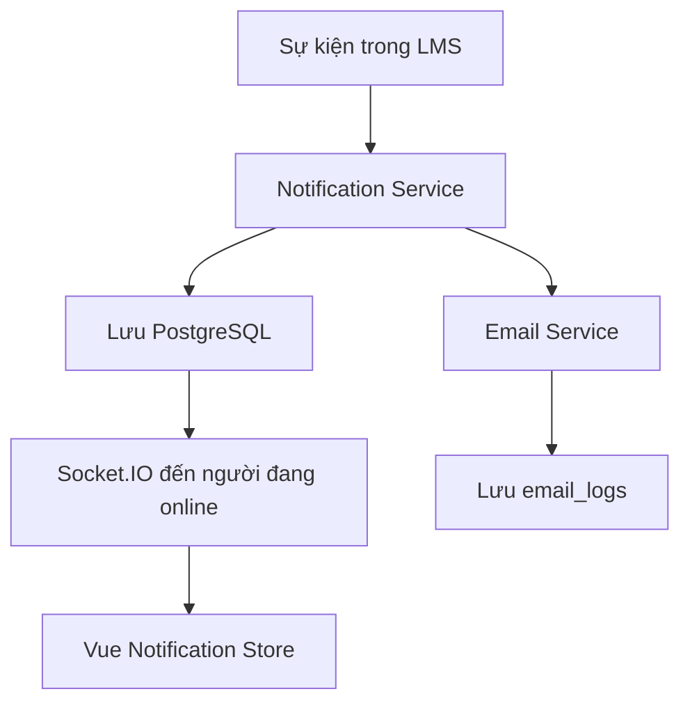

# Sprint 8 — Thông báo và giao tiếp

> Dự án: LMS Platform  
> Nhân sự: 01 Backend + 01 Frontend  
> Thời lượng đề xuất: 07 ngày làm việc  
> Công nghệ: ExpressJS, TypeScript, Prisma, PostgreSQL, Vue 3, Pinia, Tailwind CSS, Socket.IO

## 1. Mục tiêu Sprint

Sau Sprint 8, hệ thống cần đáp ứng được các yêu cầu sau:

- Người dùng xem được thông báo trong website.
- Người dùng thấy số lượng thông báo chưa đọc.
- Người dùng có thể đánh dấu đã đọc, đọc tất cả và xóa thông báo.
- Giảng viên có thể tạo và đăng thông báo cho khóa học của mình.
- Học viên đã đăng ký khóa học nhận được thông báo khi giảng viên đăng thông báo mới.
- Thông báo mới được gửi realtime khi người dùng đang online.
- Hệ thống gửi được một số email cơ bản và lưu lịch sử gửi email.
- Người dùng có thể bật hoặc tắt một số loại thông báo.

## 2. Phạm vi thực hiện

### 2.1. Làm trong Sprint 8

- In-app notification.
- Notification preferences.
- Course announcement.
- Realtime notification bằng Socket.IO.
- Email chào mừng.
- Email khi đăng ký khóa học.
- Email nhắc hạn nộp bài nếu hệ thống đã có Assignment.
- Lưu lịch sử gửi email.

### 2.2. Chưa làm trong Sprint 8

- Chat realtime đầy đủ.
- Trạng thái online/offline.
- Hỏi đáp trực tiếp.
- Push notification trên điện thoại.
- Hệ thống email queue phức tạp nếu thời gian không đủ.

Các phần chưa làm có thể tách thành Sprint 8.1 hoặc một sprint riêng.

## 3. Phân chia trách nhiệm

| Hạng mục | Backend | Frontend |
|---|---|---|
| Database | Thiết kế bảng, migration, seed | Đọc contract để tạo type |
| REST API | Xây dựng, phân quyền, test | Gọi API, xử lý loading/error |
| Swagger | Viết và cập nhật API contract | Kiểm tra contract, dùng để tích hợp |
| Notification UI | Hỗ trợ dữ liệu | Xây giao diện và Pinia store |
| Announcement | API, quyền truy cập, fan-out | Màn hình tạo và xem thông báo |
| Realtime | Socket server, xác thực JWT | Socket client, cập nhật store |
| Email | Template, gửi mail, ghi log | Không bắt buộc có giao diện |
| Testing | Unit/integration test | Component/E2E test |

Nguyên tắc: Frontend không cần chờ Backend hoàn thành. Hai bên thống nhất API contract trước, sau đó Frontend dùng mock data đúng contract.

## 4. Luồng hoạt động tổng quát



Quy tắc quan trọng:

1. Backend phải lưu thông báo vào database trước khi emit Socket.IO.
2. Nếu người dùng offline, thông báo vẫn tồn tại và được tải khi đăng nhập lại.
3. `userId` được lấy từ access token, không nhận trực tiếp từ request body.
4. Frontend chống trùng thông báo bằng `notification.id`.

## 5. Loại thông báo dùng chung

Backend và Frontend thống nhất enum sau:

```ts
export enum NotificationType {
  WELCOME = 'WELCOME',
  COURSE_ENROLLED = 'COURSE_ENROLLED',
  NEW_LESSON = 'NEW_LESSON',
  ASSIGNMENT_DUE = 'ASSIGNMENT_DUE',
  QUIZ_RESULT = 'QUIZ_RESULT',
  CERTIFICATE_ISSUED = 'CERTIFICATE_ISSUED',
  COURSE_ANNOUNCEMENT = 'COURSE_ANNOUNCEMENT',
}
```

Không nên dùng nội dung thông báo để điều hướng. Frontend điều hướng dựa vào `type` và trường `data.url`.

## 6. Thiết kế database

### 6.1. Bảng `notifications`

| Cột | Kiểu gợi ý | Bắt buộc | Mô tả |
|---|---|---:|---|
| `id` | UUID | Có | Khóa chính |
| `user_id` | UUID | Có | Người nhận thông báo |
| `type` | Enum | Có | Loại thông báo |
| `title` | VARCHAR(255) | Có | Tiêu đề |
| `message` | TEXT | Có | Nội dung ngắn |
| `data` | JSONB | Không | Dữ liệu điều hướng hoặc metadata |
| `is_read` | BOOLEAN | Có | Mặc định `false` |
| `read_at` | TIMESTAMP | Không | Thời điểm đã đọc |
| `created_at` | TIMESTAMP | Có | Thời điểm tạo |
| `updated_at` | TIMESTAMP | Có | Thời điểm cập nhật |

Index đề xuất:

- `(user_id, created_at DESC)` để tải danh sách nhanh.
- `(user_id, is_read)` để đếm chưa đọc.

### 6.2. Bảng `notification_preferences`

| Cột | Kiểu gợi ý | Bắt buộc | Mô tả |
|---|---|---:|---|
| `id` | UUID | Có | Khóa chính |
| `user_id` | UUID | Có | Unique, liên kết người dùng |
| `in_app_enabled` | BOOLEAN | Có | Mặc định `true` |
| `email_enabled` | BOOLEAN | Có | Mặc định `true` |
| `course_updates` | BOOLEAN | Có | Nhận cập nhật khóa học |
| `assignment_reminders` | BOOLEAN | Có | Nhận nhắc hạn bài tập |
| `quiz_results` | BOOLEAN | Có | Nhận kết quả quiz |
| `certificate_updates` | BOOLEAN | Có | Nhận thông tin chứng chỉ |
| `created_at` | TIMESTAMP | Có | Thời điểm tạo |
| `updated_at` | TIMESTAMP | Có | Thời điểm cập nhật |

### 6.3. Bảng `email_logs`

| Cột | Kiểu gợi ý | Bắt buộc | Mô tả |
|---|---|---:|---|
| `id` | UUID | Có | Khóa chính |
| `user_id` | UUID | Không | Người nhận nếu có tài khoản |
| `to_email` | VARCHAR(255) | Có | Email nhận |
| `subject` | VARCHAR(255) | Có | Tiêu đề email |
| `template` | VARCHAR(100) | Có | Tên template |
| `status` | Enum | Có | `PENDING`, `SENT`, `FAILED` |
| `error_message` | TEXT | Không | Lỗi khi gửi |
| `sent_at` | TIMESTAMP | Không | Thời điểm gửi thành công |
| `created_at` | TIMESTAMP | Có | Thời điểm tạo |

### 6.4. Bảng `course_announcements`

| Cột | Kiểu gợi ý | Bắt buộc | Mô tả |
|---|---|---:|---|
| `id` | UUID | Có | Khóa chính |
| `course_id` | UUID | Có | Khóa học |
| `author_id` | UUID | Có | Giảng viên tạo |
| `title` | VARCHAR(255) | Có | Tiêu đề |
| `content` | TEXT | Có | Nội dung |
| `status` | Enum | Có | `DRAFT`, `PUBLISHED` |
| `published_at` | TIMESTAMP | Không | Thời điểm đăng |
| `created_at` | TIMESTAMP | Có | Thời điểm tạo |
| `updated_at` | TIMESTAMP | Có | Thời điểm cập nhật |

## 7. API contract thống nhất trước khi code

Base URL đề xuất: `/api/v1`

### 7.1. Response của một notification

```json
{
  "id": "f4deebd8-7c48-43f3-ae4b-f01095288524",
  "type": "COURSE_ANNOUNCEMENT",
  "title": "Thông báo mới từ khóa học",
  "message": "Buổi học ngày mai bắt đầu lúc 08:00.",
  "isRead": false,
  "readAt": null,
  "data": {
    "url": "/courses/course-01/announcements/announcement-01",
    "courseId": "course-01",
    "announcementId": "announcement-01"
  },
  "createdAt": "2026-08-14T08:00:00.000Z"
}
```

### 7.2. Danh sách API

| Method | URL | Quyền | Chức năng |
|---|---|---|---|
| GET | `/notifications` | Đã đăng nhập | Lấy danh sách notification |
| GET | `/notifications/unread-count` | Đã đăng nhập | Đếm thông báo chưa đọc |
| PATCH | `/notifications/:id/read` | Chủ sở hữu | Đánh dấu đã đọc |
| PATCH | `/notifications/read-all` | Đã đăng nhập | Đánh dấu tất cả đã đọc |
| DELETE | `/notifications/:id` | Chủ sở hữu | Xóa một thông báo |
| GET | `/notification-preferences` | Đã đăng nhập | Lấy cài đặt thông báo |
| PATCH | `/notification-preferences` | Đã đăng nhập | Cập nhật cài đặt |
| GET | `/courses/:courseId/announcements` | Thành viên khóa học | Xem announcement |
| POST | `/courses/:courseId/announcements` | Giảng viên/Admin | Tạo bản nháp |
| PATCH | `/announcements/:id` | Tác giả/Admin | Sửa bản nháp |
| POST | `/announcements/:id/publish` | Tác giả/Admin | Đăng announcement |
| DELETE | `/announcements/:id` | Tác giả/Admin | Xóa announcement |

### 7.3. Lấy danh sách notification

```http
GET /api/v1/notifications?page=1&limit=20&isRead=false
Authorization: Bearer <access-token>
```

Response:

```json
{
  "data": [
    {
      "id": "notification-01",
      "type": "COURSE_ANNOUNCEMENT",
      "title": "Thông báo mới",
      "message": "Lịch học đã được cập nhật.",
      "isRead": false,
      "readAt": null,
      "data": {
        "url": "/courses/course-01/announcements"
      },
      "createdAt": "2026-08-14T08:00:00.000Z"
    }
  ],
  "meta": {
    "page": 1,
    "limit": 20,
    "total": 1,
    "totalPages": 1,
    "unreadCount": 1
  }
}
```

### 7.4. Cập nhật preferences

```http
PATCH /api/v1/notification-preferences
Authorization: Bearer <access-token>
Content-Type: application/json
```

```json
{
  "emailEnabled": true,
  "courseUpdates": true,
  "assignmentReminders": false,
  "quizResults": true,
  "certificateUpdates": true
}
```

### 7.5. Tạo announcement

```http
POST /api/v1/courses/course-01/announcements
Authorization: Bearer <instructor-access-token>
Content-Type: application/json
```

```json
{
  "title": "Thay đổi lịch học",
  "content": "Buổi học ngày mai bắt đầu lúc 08:00."
}
```

Khi tạo mới, announcement có trạng thái `DRAFT`. Chỉ khi gọi API publish thì học viên mới nhận notification.

### 7.6. Mã lỗi cần thống nhất

| HTTP status | Trường hợp |
|---:|---|
| 400 | Dữ liệu không hợp lệ |
| 401 | Chưa đăng nhập hoặc token hết hạn |
| 403 | Không có quyền trên khóa học/thông báo |
| 404 | Không tìm thấy resource |
| 409 | Announcement đã publish hoặc thao tác trùng |
| 500 | Lỗi không mong muốn |

Format lỗi đề xuất:

```json
{
  "error": {
    "code": "FORBIDDEN",
    "message": "Bạn không có quyền thực hiện thao tác này",
    "details": []
  }
}
```

## 8. Socket.IO contract

### 8.1. Kết nối

Frontend gửi access token khi kết nối:

```ts
const socket = io(SOCKET_URL, {
  auth: {
    token: accessToken,
  },
});
```

Backend xác thực token, lấy `userId` và cho socket tham gia room:

```text
user:<userId>
```

Frontend không được tự truyền `userId` để yêu cầu tham gia room.

### 8.2. Danh sách event

| Event | Chiều | Payload | Mục đích |
|---|---|---|---|
| `notification:new` | Server → Client | Notification object | Nhận thông báo mới |
| `notification:read` | Server → Client | `{ id }` | Đồng bộ đã đọc giữa nhiều tab |
| `notification:read-all` | Server → Client | `{ readAt }` | Đồng bộ đọc tất cả |
| `announcement:published` | Server → Client | Announcement summary | Báo có announcement mới |

Frontend phải ngắt socket khi đăng xuất và kết nối lại khi access token thay đổi.

## 9. Cấu trúc thư mục Backend đề xuất

```text
backend/
├── prisma/
│   ├── schema.prisma
│   └── seed.ts
├── src/
│   ├── config/
│   │   ├── env.ts
│   │   └── mail.ts
│   ├── modules/
│   │   ├── notifications/
│   │   │   ├── notification.controller.ts
│   │   │   ├── notification.service.ts
│   │   │   ├── notification.repository.ts
│   │   │   ├── notification.routes.ts
│   │   │   ├── notification.validation.ts
│   │   │   └── notification.types.ts
│   │   ├── notification-preferences/
│   │   │   ├── preference.controller.ts
│   │   │   ├── preference.service.ts
│   │   │   └── preference.routes.ts
│   │   └── announcements/
│   │       ├── announcement.controller.ts
│   │       ├── announcement.service.ts
│   │       ├── announcement.repository.ts
│   │       ├── announcement.routes.ts
│   │       └── announcement.validation.ts
│   ├── services/
│   │   ├── email/
│   │   │   ├── email.service.ts
│   │   │   └── templates/
│   │   └── realtime/
│   │       └── socket.service.ts
│   ├── events/
│   │   ├── event-bus.ts
│   │   └── notification.handlers.ts
│   ├── app.ts
│   └── server.ts
└── tests/
    ├── integration/
    │   ├── notifications.test.ts
    │   └── announcements.test.ts
    └── unit/
        └── notification.service.test.ts
```

Không bắt buộc phải chia đúng hoàn toàn như trên. Quan trọng là controller, business logic và truy vấn database không dồn chung vào một file.

## 10. Task Backend

### BE8-01 — Thiết kế database và migration

**Công việc**

- Thêm enum và bốn model vào Prisma.
- Khai báo relation với `User` và `Course`.
- Tạo index cần thiết.
- Chạy migration và kiểm tra Prisma Studio.
- Tạo seed dữ liệu mẫu nếu cần.

**Acceptance criteria**

- Migration chạy được trên database mới.
- Một User có thể có nhiều notifications.
- Một Course có thể có nhiều announcements.
- Xóa User/Course tuân theo chính sách `onDelete` đã thống nhất.

**Ước lượng:** 5 giờ.

### BE8-02 — Notification service

**Công việc**

- Viết hàm tạo notification.
- Viết hàm tạo notification cho nhiều người nhận.
- Kiểm tra preferences trước khi tạo/gửi.
- Hỗ trợ `data` dạng JSON.
- Tách service để module Enrollment, Quiz, Assignment có thể gọi lại.

Giao diện service gợi ý:

```ts
type CreateNotificationInput = {
  userId: string;
  type: NotificationType;
  title: string;
  message: string;
  data?: Record<string, unknown>;
};

createNotification(input: CreateNotificationInput): Promise<Notification>;
createManyNotifications(inputs: CreateNotificationInput[]): Promise<void>;
```

**Acceptance criteria**

- Tạo đúng notification cho một người.
- Không nhận `userId` người đang thao tác từ nguồn không tin cậy.
- Tạo nhiều notification không làm hệ thống lỗi nếu một người đang offline.

**Ước lượng:** 5 giờ.

### BE8-03 — Notification REST API

**Công việc**

- Viết API danh sách có phân trang và bộ lọc.
- Viết API unread count.
- Viết API read, read-all và delete.
- Kiểm tra ownership ở mọi thao tác có `:id`.
- Viết Swagger.

**Acceptance criteria**

- User A không đọc hoặc xóa được notification của User B.
- Danh sách sắp xếp mới nhất trước.
- Gọi read nhiều lần vẫn cho kết quả an toàn.
- Unread count giảm đúng sau khi đọc.

**Ước lượng:** 6 giờ.

### BE8-04 — Notification preferences API

**Công việc**

- Tạo preferences mặc định khi cần.
- Viết API GET/PATCH.
- Validate các trường boolean.

**Acceptance criteria**

- Người dùng chỉ cập nhật preferences của chính mình.
- Bỏ trống một trường không làm thay đổi trường đó.
- Preferences được áp dụng khi tạo notification/email tương ứng.

**Ước lượng:** 3 giờ.

### BE8-05 — Course announcement API

**Công việc**

- CRUD announcement.
- Kiểm tra giảng viên có sở hữu khóa học hoặc có quyền phù hợp.
- Học viên chỉ xem announcement của khóa học đã đăng ký.
- Khi publish, tạo notification cho học viên.
- Tránh tạo notification hai lần nếu publish lại.

**Acceptance criteria**

- Student không tạo/sửa/xóa announcement.
- Giảng viên không sửa announcement của khóa học người khác.
- Draft không hiển thị cho học viên.
- Publish thành công tạo notification đúng một lần cho mỗi học viên.

**Ước lượng:** 7 giờ.

### BE8-06 — Realtime notification

**Công việc**

- Khởi tạo Socket.IO cùng HTTP server.
- Xác thực JWT trong Socket.IO middleware.
- Join room theo user đã xác thực.
- Emit notification sau khi lưu database thành công.
- Xử lý disconnect và lỗi token.

**Acceptance criteria**

- Token không hợp lệ không kết nối được.
- User chỉ nhận event thuộc room của mình.
- User offline vẫn xem được notification sau khi đăng nhập lại.
- Không emit nếu transaction tạo notification thất bại.

**Ước lượng:** 5 giờ.

### BE8-07 — Email service và email log

**Công việc**

- Cấu hình email qua biến môi trường.
- Tạo template email chào mừng và đăng ký khóa học.
- Cập nhật `email_logs` theo `PENDING`, `SENT`, `FAILED`.
- Không làm đăng ký tài khoản thất bại chỉ vì email lỗi.
- Không ghi mật khẩu hoặc secret vào log.

**Acceptance criteria**

- Email thành công có `status = SENT` và `sentAt`.
- Email lỗi có `status = FAILED` và thông tin lỗi phù hợp.
- API chính vẫn trả kết quả đúng khi nhà cung cấp email tạm lỗi.

**Ước lượng:** 5 giờ.

### BE8-08 — Backend test và tài liệu

**Công việc**

- Unit test notification service.
- Integration test các API chính.
- Test authorization và ownership.
- Cập nhật Swagger và file `.env.example`.

**Acceptance criteria**

- Test các trường hợp thành công, không đăng nhập, không có quyền và không tìm thấy.
- Test chạy được bằng một command đã ghi trong README.
- Swagger khớp response thực tế.

**Ước lượng:** 6 giờ.

## 11. Cấu trúc thư mục Frontend đề xuất

```text
frontend/
├── src/
│   ├── api/
│   │   ├── notification.api.ts
│   │   ├── notification-preference.api.ts
│   │   └── announcement.api.ts
│   ├── components/
│   │   ├── notifications/
│   │   │   ├── NotificationBell.vue
│   │   │   ├── NotificationDropdown.vue
│   │   │   ├── NotificationItem.vue
│   │   │   └── NotificationBadge.vue
│   │   └── announcements/
│   │       ├── AnnouncementCard.vue
│   │       └── AnnouncementForm.vue
│   ├── stores/
│   │   └── notification.store.ts
│   ├── services/
│   │   └── socket.service.ts
│   ├── types/
│   │   ├── notification.ts
│   │   └── announcement.ts
│   ├── views/
│   │   ├── NotificationCenterView.vue
│   │   ├── NotificationSettingsView.vue
│   │   └── CourseAnnouncementsView.vue
│   └── router/
│       └── index.ts
└── tests/
    ├── components/
    │   └── NotificationItem.spec.ts
    └── e2e/
        └── notifications.spec.ts
```

## 12. Task Frontend

### FE8-01 — Types, mock data và API client

**Công việc**

- Tạo TypeScript types theo contract.
- Tạo mock notifications và announcements.
- Viết API client.
- Chuẩn hóa xử lý response/error.

**Acceptance criteria**

- Type không dùng `any` cho payload chính.
- Mock data giống response Backend đã thống nhất.
- Có thể đổi mock sang API thật mà không sửa component lớn.

**Ước lượng:** 4 giờ.

### FE8-02 — Pinia notification store

**Công việc**

- State: items, unreadCount, loading, pagination.
- Action: fetch, load more, mark read, mark all read, delete.
- Action: thêm notification từ Socket.IO.
- Chống trùng theo ID.

**Acceptance criteria**

- Unread count cập nhật ngay sau thao tác.
- API lỗi thì UI hiển thị lỗi và không sai state.
- Event trùng ID không tạo hai item.

**Ước lượng:** 5 giờ.

### FE8-03 — Notification bell và dropdown

**Công việc**

- Bell trên header.
- Badge số lượng chưa đọc.
- Dropdown hiển thị danh sách gần nhất.
- Click item đánh dấu đã đọc và điều hướng.
- Trạng thái rỗng, loading và lỗi.

**Acceptance criteria**

- Badge ẩn khi unread count bằng 0.
- Item chưa đọc có biểu hiện trực quan.
- Có liên kết đến trang xem tất cả.
- Hoạt động trên desktop và mobile.

**Ước lượng:** 6 giờ.

### FE8-04 — Notification Center

**Công việc**

- Trang xem tất cả notification.
- Filter tất cả/chưa đọc.
- Phân trang hoặc load more.
- Nút đọc tất cả và xóa từng item.

**Acceptance criteria**

- Refresh trang vẫn lấy đúng dữ liệu từ server.
- Filter và pagination sử dụng query đã thống nhất.
- Điều hướng theo `data.url` an toàn.

**Ước lượng:** 5 giờ.

### FE8-05 — Notification settings

**Công việc**

- Tạo màn hình preferences.
- Hiển thị switch cho từng nhóm thông báo.
- Gọi API PATCH và hiển thị trạng thái lưu.

**Acceptance criteria**

- Tải được preferences hiện tại.
- Lưu thành công có phản hồi rõ ràng.
- Lưu lỗi hoàn nguyên state hoặc cho phép thử lại.

**Ước lượng:** 4 giờ.

### FE8-06 — Instructor announcement UI

**Công việc**

- Danh sách announcement trong trang quản lý khóa học.
- Form tạo/sửa bản nháp.
- Nút publish có hộp xác nhận.
- Nút xóa theo quyền.

**Acceptance criteria**

- Validate title/content trước khi gửi.
- Phân biệt rõ `DRAFT` và `PUBLISHED`.
- Publish xong cập nhật danh sách mà không cần reload toàn trang.

**Ước lượng:** 6 giờ.

### FE8-07 — Student announcement UI

**Công việc**

- Thêm tab announcement trong trang khóa học.
- Hiển thị nội dung và thời gian đăng.
- Xử lý empty/loading/error.

**Acceptance criteria**

- Chỉ hiển thị announcement đã publish.
- Mới nhất hiển thị trước.
- Học viên không thấy nút quản trị.

**Ước lượng:** 3 giờ.

### FE8-08 — Socket.IO client

**Công việc**

- Kết nối socket sau khi đăng nhập.
- Gửi access token trong handshake.
- Lắng nghe các event đã thống nhất.
- Đưa notification mới vào Pinia store.
- Disconnect khi logout.

**Acceptance criteria**

- Notification xuất hiện mà không cần reload trang.
- Không tạo nhiều socket connection khi chuyển route.
- Mất mạng và kết nối lại không làm nhân đôi item.
- Token hết hạn được xử lý theo auth flow hiện tại.

**Ước lượng:** 5 giờ.

### FE8-09 — Frontend test

**Công việc**

- Component test NotificationItem/NotificationBell.
- Test Pinia action chính.
- E2E luồng nhận và đọc notification.
- Kiểm tra responsive và accessibility cơ bản.

**Acceptance criteria**

- Có test trạng thái rỗng, loading, error và có dữ liệu.
- Có E2E scenario giảng viên publish, học viên nhận thông báo.
- Button/icon có accessible label phù hợp.

**Ước lượng:** 5 giờ.

## 13. Kế hoạch 07 ngày cho hai người

| Ngày | Backend | Frontend | Kết quả chung |
|---:|---|---|---|
| 1 | Chốt schema, enum, API và Socket contract | Chốt UX, type và mock data | Contract được commit vào docs |
| 2 | Migration, notification service | API client, Pinia store | Store chạy được bằng mock |
| 3 | Notification API, preferences API | Bell, dropdown, center | Tích hợp REST lần đầu |
| 4 | Announcement API và phân quyền | Instructor/Student announcement UI | Tạo và xem announcement |
| 5 | Socket.IO server | Socket.IO client | Notification realtime hoạt động |
| 6 | Email service, email logs | Settings UI, hoàn thiện responsive | Preferences và email cơ bản |
| 7 | Integration test, Swagger, sửa lỗi | Component/E2E test, sửa lỗi | Demo và nghiệm thu sprint |

Nếu Backend chưa xong API trong ngày 2–3, Frontend tiếp tục dùng mock. Không đổi contract bằng trao đổi miệng; mọi thay đổi phải cập nhật Swagger hoặc `docs/api.md`.

## 14. Thứ tự tích hợp để tránh chờ nhau

1. Hai người review API contract và ví dụ JSON.
2. Backend tạo migration và endpoint skeleton.
3. Frontend tạo type, mock data và giao diện.
4. Backend hoàn thành notification API và test bằng Postman/Swagger.
5. Frontend thay mock bằng API thật.
6. Backend hoàn thành announcement và Socket.IO.
7. Frontend kết nối Socket.IO.
8. Hai người chạy E2E cùng nhau.

Khi Backend thay đổi response:

- Cập nhật Swagger hoặc `docs/api.md` trong cùng Pull Request.
- Báo Frontend biết trường nào thay đổi.
- Frontend cập nhật type trước khi sửa component.

## 15. Git branch đề xuất

### Backend

```text
feature/notification-database
feature/notification-api
feature/notification-preferences
feature/announcement-api
feature/notification-socket
feature/notification-email
```

### Frontend

```text
feature/notification-store
feature/notification-ui
feature/notification-preferences-ui
feature/announcement-ui
feature/notification-socket-client
```

Mọi feature branch tạo từ `develop` và Pull Request trở lại `develop`:

```bash
git switch develop
git pull origin develop
git switch -c feature/notification-api
```

Sau khi hoàn thành:

```bash
git add .
git commit -m "feat(notification): add notification APIs"
git push -u origin feature/notification-api
```

Không Pull Request feature trực tiếp vào `main`. Chỉ merge `develop` vào `main` sau khi Sprint 8 đã được test và sẵn sàng release.

## 16. Scenario kiểm thử end-to-end

### Scenario 1 — Xem notification

1. Học viên đăng nhập.
2. Hệ thống trả về danh sách notification.
3. Header hiển thị unread count.
4. Học viên mở dropdown.
5. Học viên chọn một notification.
6. Notification được đánh dấu đã đọc.
7. Badge giảm đúng một đơn vị.

### Scenario 2 — Publish announcement realtime

1. Giảng viên đăng nhập và mở khóa học mình quản lý.
2. Giảng viên tạo announcement ở trạng thái draft.
3. Giảng viên bấm publish.
4. Backend cập nhật trạng thái và tạo notification cho học viên.
5. Học viên đang online nhận `notification:new`.
6. Notification xuất hiện trên bell mà không reload.
7. Học viên click và được điều hướng đến announcement.

### Scenario 3 — Người dùng offline

1. Học viên không mở website.
2. Giảng viên publish announcement.
3. Backend lưu notification.
4. Học viên đăng nhập sau đó.
5. Notification vẫn xuất hiện trong danh sách.

### Scenario 4 — Phân quyền

1. Giảng viên A tạo khóa học A.
2. Giảng viên B gọi API tạo announcement cho khóa học A.
3. Backend trả về `403 Forbidden`.
4. Hệ thống không tạo announcement và notification.

### Scenario 5 — Email lỗi

1. Người dùng đăng ký tài khoản thành công.
2. Email provider trả lỗi.
3. Tài khoản vẫn được tạo.
4. `email_logs` ghi nhận `FAILED`.
5. Hệ thống không trả thông tin secret trong response hoặc log.

## 17. Definition of Done

Một task chỉ được xem là hoàn thành khi:

- [ ] Code đã format và không còn lỗi lint.
- [ ] API hoặc component chạy đúng acceptance criteria.
- [ ] Có xử lý loading, empty và error phù hợp.
- [ ] Có kiểm tra authentication và authorization.
- [ ] Không lộ token, password hoặc secret trong log.
- [ ] Swagger/API docs khớp code thực tế.
- [ ] Test liên quan đã chạy thành công.
- [ ] Pull Request vào `develop` đã được người còn lại review.
- [ ] Không còn conflict với `develop`.
- [ ] Có bằng chứng test hoặc hướng dẫn test trong Pull Request.

Sprint 8 chỉ được xem là hoàn thành khi:

- [ ] Notification bell và unread count hoạt động.
- [ ] Người dùng đọc, đọc tất cả và xóa được notification của mình.
- [ ] Preferences được lưu và áp dụng.
- [ ] Giảng viên tạo, sửa, publish và xóa được announcement đúng quyền.
- [ ] Học viên xem được announcement đã publish.
- [ ] Notification realtime hoạt động cho người đang online.
- [ ] Người offline vẫn nhận được notification khi quay lại.
- [ ] Email cơ bản có log `SENT` hoặc `FAILED`.
- [ ] Scenario E2E chính chạy thành công.
- [ ] Code đã merge vào `develop`; chưa merge `main` nếu chưa release.

## 18. Kết quả bàn giao

- Prisma schema và migration cho bốn bảng.
- Swagger hoặc `docs/api.md` chứa contract Sprint 8.
- Notification REST API.
- Notification preferences API.
- Course announcement API.
- Socket.IO notification server/client.
- Email service và email logs cơ bản.
- Notification UI, settings UI và announcement UI.
- Unit test, integration test và E2E test chính.
- README có lệnh chạy, test và biến môi trường cần thiết.

## 19. Gợi ý demo cuối Sprint

1. Mở hai trình duyệt: một tài khoản giảng viên và một tài khoản học viên.
2. Giảng viên tạo rồi publish announcement.
3. Học viên nhận notification realtime.
4. Học viên mở notification và xem announcement.
5. Học viên đánh dấu tất cả đã đọc.
6. Tắt một preference và chứng minh hệ thống áp dụng cài đặt đó.
7. Kiểm tra Swagger, database và `email_logs` để xác nhận dữ liệu được lưu đúng.
