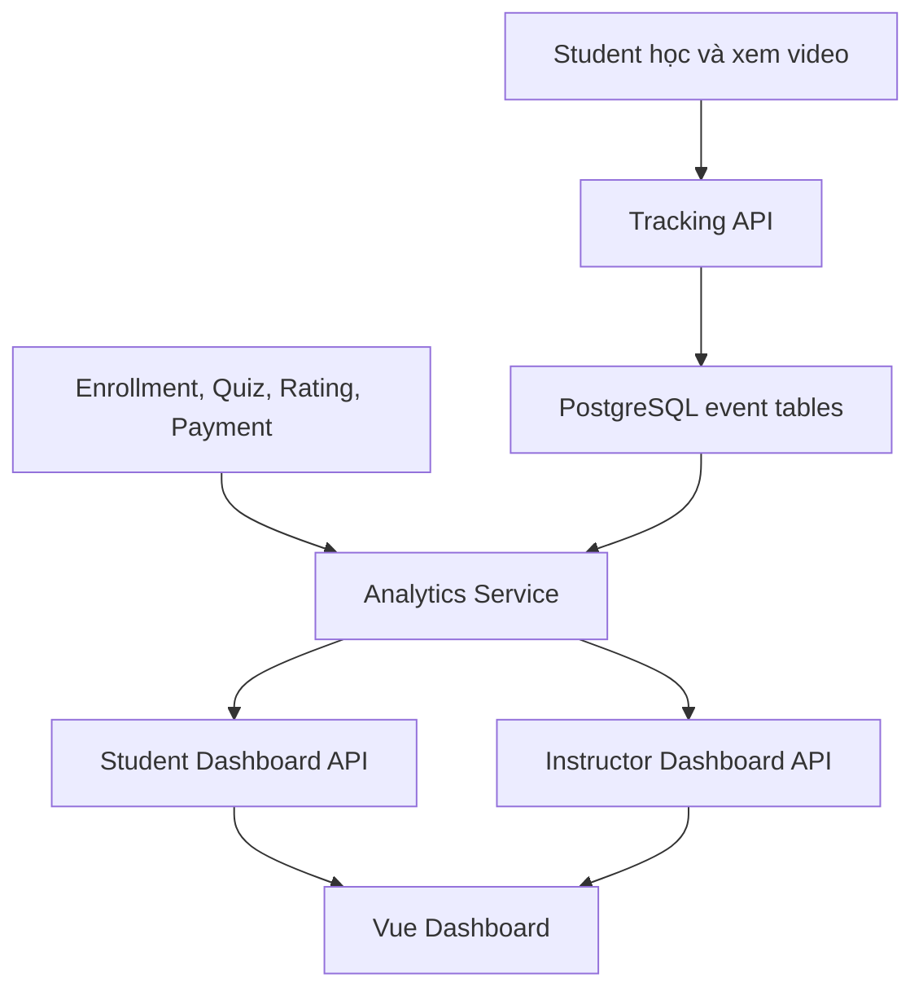
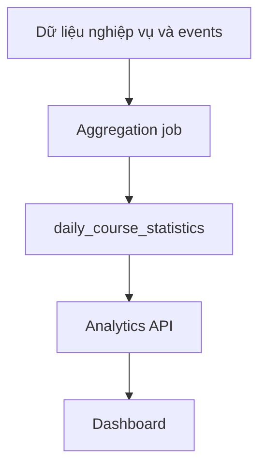

# Sprint 9 — Analytics cho Student và Instructor

> Dự án: LMS Platform  
> Nhân sự đề xuất: 01 Backend + 01 Frontend  
> Thời lượng đề xuất: 07 ngày làm việc  
> Công nghệ: ExpressJS, TypeScript, Prisma, PostgreSQL, Vue 3, Pinia, Tailwind CSS

## 1. Mục tiêu Sprint

Sprint 9 xây dựng dashboard phân tích dữ liệu cho hai nhóm người dùng:

- **Student:** theo dõi quá trình học, kết quả và thói quen học tập cá nhân.
- **Instructor:** theo dõi hiệu quả khóa học, học viên, quiz, rating và doanh thu.

Sau Sprint 9, hệ thống cần đạt được:

- Student chỉ xem analytics của chính mình.
- Instructor chỉ xem analytics của các khóa học mình quản lý.
- Các chỉ số trên giao diện và API có định nghĩa rõ ràng, nhất quán.
- Dashboard có bộ lọc thời gian và trạng thái loading, empty, error.
- Backend xử lý aggregation bằng PostgreSQL trước.
- Có event tracking tối thiểu để tính thời gian học và hành vi xem video.
- Có test cho phép tính, phân quyền và các luồng dashboard chính.

## 2. Giá trị của Sprint trong portfolio

Sprint này thể hiện được nhiều năng lực quan trọng:

- Thiết kế event tracking.
- Tổng hợp dữ liệu bằng PostgreSQL.
- Thiết kế API phục vụ dashboard.
- Xây dựng biểu đồ và KPI cards.
- Xử lý bộ lọc theo thời gian.
- Kiểm soát quyền truy cập dữ liệu analytics.
- Tối ưu truy vấn và thiết kế chiến lược pre-aggregation.
- Kiểm thử số liệu từ database đến giao diện.

## 3. Phạm vi thực hiện

### 3.1. Dashboard Student

- Tổng số khóa học đã đăng ký.
- Số khóa học đang học.
- Số khóa học đã hoàn thành.
- Tổng thời gian học.
- Điểm quiz trung bình.
- Biểu đồ tiến độ khóa học.
- Chuỗi ngày học liên tục.
- Danh sách khóa học tiếp tục học.

### 3.2. Dashboard Instructor

- Tổng số học viên duy nhất.
- Số lượt đăng ký theo ngày.
- Tỷ lệ hoàn thành khóa học.
- Bài học có tỷ lệ bỏ dở cao.
- Điểm quiz trung bình.
- Doanh thu.
- Rating trung bình.
- Khóa học hoạt động tốt nhất.

### 3.3. Event tracking

- Ghi nhận hoạt động học tập cơ bản.
- Ghi nhận phiên xem video.
- Chống ghi nhận thời gian học không hợp lệ ở mức cơ bản.
- Hỗ trợ truy vấn theo user, course và khoảng thời gian.

### 3.4. Chưa làm trong Sprint 9

- Data warehouse riêng.
- Kafka hoặc hệ thống streaming dữ liệu.
- ClickHouse, Elasticsearch hoặc BigQuery.
- Dashboard cập nhật từng giây.
- Machine Learning dự đoán học viên bỏ học.
- Xuất báo cáo PDF/Excel.
- Analytics cấp Admin toàn hệ thống.

Những phần trên có thể mở rộng sau khi dữ liệu và lượng truy cập đủ lớn.

## 4. Nguyên tắc triển khai

1. Backend và Frontend thống nhất công thức tính trước khi code.
2. Frontend dùng mock data đúng API contract, không chờ Backend hoàn thành.
3. Backend ưu tiên truy vấn trực tiếp PostgreSQL trong phiên bản đầu.
4. Chỉ dùng `daily_course_statistics` khi truy vấn trực tiếp bắt đầu chậm hoặc dữ liệu đủ lớn.
5. Mỗi KPI phải ghi rõ đơn vị, khoảng thời gian và điều kiện lọc.
6. Không tin tưởng `userId` hoặc `instructorId` do client gửi lên; lấy từ access token.
7. Analytics không được làm lộ dữ liệu của học viên hoặc giảng viên khác.

## 5. Phân chia trách nhiệm

| Hạng mục | Backend | Frontend |
|---|---|---|
| Metric definitions | Đề xuất công thức từ database | Review cách hiển thị và đơn vị |
| Database | Event tables, index, migration | Tạo type tương ứng contract |
| Event tracking | Validate và lưu event | Gửi event đúng thời điểm |
| Student analytics | Aggregate và trả API | KPI cards, chart, course progress |
| Instructor analytics | Aggregate, filter, phân quyền | KPI cards, chart, data table |
| Swagger/API docs | Viết và cập nhật contract | Kiểm tra bằng mock/API thật |
| Performance | EXPLAIN ANALYZE, index, cache nếu cần | Tránh gọi API lặp, debounce filter |
| Testing | Unit/integration/data correctness | Component/E2E và visual states |

## 6. Luồng dữ liệu tổng quát



Luồng nâng cấp khi dữ liệu lớn:



## 7. Định nghĩa chỉ số

Phần này là nguồn thống nhất giữa Backend, Frontend và Tester. Không tự thay đổi công thức trong lúc code.

### 7.1. Chỉ số Student

| Chỉ số | Định nghĩa đề xuất |
|---|---|
| Tổng khóa học đăng ký | Số enrollment hợp lệ của student, không tính bản ghi đã hủy nếu hệ thống hỗ trợ hủy |
| Đang học | Enrollment chưa hoàn thành và có ít nhất một hoạt động học hoặc trạng thái `IN_PROGRESS` |
| Hoàn thành | Enrollment có `completedAt` hoặc `progressPercent = 100` |
| Tổng thời gian học | Tổng `durationSeconds` hợp lệ từ learning/video events của student |
| Điểm quiz trung bình | Trung bình phần trăm điểm của các attempt đã submit; thống nhất dùng attempt tốt nhất hoặc lần cuối |
| Tiến độ khóa học | Số lesson đã hoàn thành / tổng lesson đã publish × 100 |
| Chuỗi ngày học | Số ngày liên tiếp tính lùi từ hôm nay hoặc hôm qua có ít nhất một learning event hợp lệ |

Quyết định đề xuất cho quiz:

- Dashboard Student dùng **attempt tốt nhất của mỗi quiz**.
- Không tính attempt ở trạng thái draft/in-progress.
- Nếu quiz chưa có attempt đã submit thì không đưa vào mẫu số.

### 7.2. Chỉ số Instructor

| Chỉ số | Định nghĩa đề xuất |
|---|---|
| Tổng học viên | Số student duy nhất có enrollment hợp lệ trong các khóa học của instructor |
| Lượt đăng ký theo ngày | Số enrollment mới, nhóm theo ngày và múi giờ hệ thống |
| Tỷ lệ hoàn thành | Số enrollment hoàn thành / tổng enrollment hợp lệ × 100 |
| Bài học bỏ dở cao | Lesson có số phiên bắt đầu nhưng không hoàn thành cao nhất |
| Điểm quiz trung bình | Trung bình phần trăm điểm từ attempt hợp lệ trong khóa học của instructor |
| Doanh thu | Tổng payment thành công, trừ refund nếu hệ thống có hoàn tiền |
| Rating trung bình | Trung bình rating hiện còn hiệu lực |
| Khóa học tốt nhất | Xếp hạng theo enrollment, completion, rating hoặc revenue đã chọn trước |

Quyết định đề xuất cho “khóa học hoạt động tốt nhất”:

- Phiên bản đầu cho phép sort theo `enrollments`, `completionRate`, `rating` hoặc `revenue`.
- Giao diện mặc định sort theo `enrollments` trong khoảng thời gian được chọn.
- Không tạo một “điểm tổng hợp” nếu chưa thống nhất trọng số.

### 7.3. Quy ước ngày và múi giờ

- API nhận ngày theo `YYYY-MM-DD`.
- Timestamp trong database lưu UTC.
- Việc nhóm theo ngày dùng timezone cấu hình của hệ thống, đề xuất `Asia/Ho_Chi_Minh`.
- Khoảng thời gian gồm `from` và `to` theo ngày địa phương.
- Frontend hiển thị ngày theo locale `vi-VN`.

## 8. Thiết kế database hỗ trợ

### 8.1. Bảng `learning_events`

Ghi nhận các hành vi học tập quan trọng, không ghi mọi click không cần thiết.

| Cột | Kiểu gợi ý | Bắt buộc | Mô tả |
|---|---|---:|---|
| `id` | UUID | Có | Khóa chính |
| `user_id` | UUID | Có | Student thực hiện |
| `course_id` | UUID | Có | Khóa học liên quan |
| `lesson_id` | UUID | Không | Bài học liên quan |
| `event_type` | Enum | Có | Loại sự kiện |
| `duration_seconds` | INTEGER | Không | Thời lượng hợp lệ |
| `metadata` | JSONB | Không | Dữ liệu phụ có kiểm soát |
| `occurred_at` | TIMESTAMP | Có | Thời điểm sự kiện xảy ra |
| `created_at` | TIMESTAMP | Có | Thời điểm server lưu |

Enum đề xuất:

```ts
export enum LearningEventType {
  COURSE_OPENED = 'COURSE_OPENED',
  LESSON_STARTED = 'LESSON_STARTED',
  LESSON_COMPLETED = 'LESSON_COMPLETED',
  QUIZ_STARTED = 'QUIZ_STARTED',
  QUIZ_SUBMITTED = 'QUIZ_SUBMITTED',
  STUDY_SESSION = 'STUDY_SESSION',
}
```

Index đề xuất:

- `(user_id, occurred_at)`.
- `(course_id, occurred_at)`.
- `(lesson_id, event_type)`.
- `(user_id, course_id, occurred_at)` nếu truy vấn tiến độ thường xuyên.

### 8.2. Bảng `video_watch_events`

| Cột | Kiểu gợi ý | Bắt buộc | Mô tả |
|---|---|---:|---|
| `id` | UUID | Có | Khóa chính |
| `user_id` | UUID | Có | Student xem video |
| `course_id` | UUID | Có | Khóa học |
| `lesson_id` | UUID | Có | Lesson chứa video |
| `session_id` | UUID | Có | ID phiên xem do client tạo |
| `started_at` | TIMESTAMP | Có | Bắt đầu đoạn xem |
| `ended_at` | TIMESTAMP | Không | Kết thúc đoạn xem |
| `start_position_seconds` | INTEGER | Có | Vị trí video lúc bắt đầu |
| `end_position_seconds` | INTEGER | Không | Vị trí video lúc kết thúc |
| `watched_seconds` | INTEGER | Có | Thời lượng được chấp nhận |
| `completed` | BOOLEAN | Có | Đã xem đủ điều kiện hoàn thành |
| `created_at` | TIMESTAMP | Có | Thời điểm lưu |

Index đề xuất:

- `(user_id, lesson_id, started_at)`.
- `(course_id, lesson_id)`.
- Unique hoặc cơ chế idempotency theo `session_id` và mốc event.

### 8.3. Bảng `daily_course_statistics`

Bảng này là **tùy chọn trong phiên bản đầu**. Có thể tạo schema nhưng chưa cần dùng nếu truy vấn trực tiếp vẫn nhanh.

| Cột | Kiểu gợi ý | Bắt buộc | Mô tả |
|---|---|---:|---|
| `id` | UUID | Có | Khóa chính |
| `course_id` | UUID | Có | Khóa học |
| `stat_date` | DATE | Có | Ngày thống kê |
| `new_enrollments` | INTEGER | Có | Enrollment mới trong ngày |
| `active_students` | INTEGER | Có | Student có event trong ngày |
| `completed_enrollments` | INTEGER | Có | Enrollment hoàn thành trong ngày |
| `learning_seconds` | BIGINT | Có | Tổng thời gian học |
| `quiz_attempts` | INTEGER | Có | Số attempt đã submit |
| `average_quiz_score` | DECIMAL | Không | Điểm quiz trung bình |
| `revenue` | DECIMAL | Có | Doanh thu hợp lệ trong ngày |
| `average_rating` | DECIMAL | Không | Rating trung bình tại thời điểm tổng hợp |
| `created_at` | TIMESTAMP | Có | Thời điểm tạo |
| `updated_at` | TIMESTAMP | Có | Thời điểm cập nhật |

Constraint đề xuất:

```text
UNIQUE(course_id, stat_date)
```

### 8.4. Relation với bảng hiện có

Sprint 9 dự kiến sử dụng các bảng đã có:

- `users`.
- `courses`.
- `lessons`.
- `enrollments`.
- `lesson_progress` hoặc bảng tương đương.
- `quizzes`.
- `quiz_attempts`.
- `ratings` hoặc `reviews`.
- `payments`, `orders` hoặc `transactions` nếu đã triển khai thanh toán.

Nếu chưa có payment, API vẫn trả trường revenue với:

```json
{
  "amount": 0,
  "currency": "VND",
  "available": false
}
```

Frontend hiển thị “Chưa có dữ liệu thanh toán”, không giả lập doanh thu thật.

## 9. Quy tắc ghi nhận event

### 9.1. Event do Backend tự tạo

Các event có nguồn dữ liệu chắc chắn nên được tạo từ Backend:

- `LESSON_COMPLETED` sau khi API hoàn thành lesson thành công.
- `QUIZ_SUBMITTED` sau khi submit quiz thành công.
- Enrollment mới lấy trực tiếp từ bảng enrollment, không cần client gửi event.
- Payment thành công lấy từ payment/webhook, không cần client gửi event.

### 9.2. Event do Frontend gửi

Frontend có thể gửi:

- `COURSE_OPENED`.
- `LESSON_STARTED`.
- Heartbeat hoặc kết thúc phiên để tính thời gian học.
- Video watch progress theo khoảng thời gian hợp lý.

### 9.3. Chống dữ liệu không hợp lệ cơ bản

- Backend lấy `userId` từ access token.
- Kiểm tra user đã enrollment khóa học.
- Giới hạn `durationSeconds` trên mỗi request, ví dụ tối đa 300 giây.
- Không cộng thời gian âm.
- Không cộng thời gian lớn hơn thời gian thực giữa hai heartbeat.
- Dùng `sessionId` để chống request trùng.
- Không gửi event mỗi giây; đề xuất heartbeat mỗi 30–60 giây.
- Dừng heartbeat khi tab bị ẩn lâu, video pause hoặc người dùng rời trang.

## 10. API contract

Base URL đề xuất: `/api/v1`

### 10.1. Danh sách API

| Method | URL | Quyền | Chức năng |
|---|---|---|---|
| POST | `/analytics/events` | Student | Ghi learning event |
| POST | `/analytics/video-watch-events` | Student | Ghi phiên xem video |
| GET | `/analytics/student/overview` | Student | KPI tổng quan cá nhân |
| GET | `/analytics/student/course-progress` | Student | Tiến độ các khóa học |
| GET | `/analytics/student/activity` | Student | Hoạt động học theo ngày |
| GET | `/analytics/student/streak` | Student | Chuỗi ngày học |
| GET | `/analytics/instructor/overview` | Instructor | KPI tổng quan |
| GET | `/analytics/instructor/enrollments` | Instructor | Lượt đăng ký theo ngày |
| GET | `/analytics/instructor/course-performance` | Instructor | Hiệu quả từng khóa học |
| GET | `/analytics/instructor/drop-off-lessons` | Instructor | Lesson có tỷ lệ bỏ dở cao |

### 10.2. Query parameters dùng chung

| Parameter | Ví dụ | Mô tả |
|---|---|---|
| `from` | `2026-08-01` | Ngày bắt đầu |
| `to` | `2026-08-31` | Ngày kết thúc |
| `courseId` | UUID | Lọc một khóa học thuộc instructor |
| `groupBy` | `day` | `day`, `week`, `month` nếu endpoint hỗ trợ |
| `limit` | `10` | Giới hạn bảng xếp hạng |

Giới hạn đề xuất:

- Khoảng thời gian mặc định: 30 ngày gần nhất.
- Khoảng thời gian tối đa cho dữ liệu theo ngày: 365 ngày.
- `courseId` phải thuộc instructor đang đăng nhập.

### 10.3. Student overview

```http
GET /api/v1/analytics/student/overview
Authorization: Bearer <student-access-token>
```

```json
{
  "data": {
    "enrolledCourses": 6,
    "inProgressCourses": 3,
    "completedCourses": 2,
    "notStartedCourses": 1,
    "totalLearningSeconds": 45240,
    "averageQuizScore": 82.5,
    "currentStreakDays": 5,
    "longestStreakDays": 12
  }
}
```

### 10.4. Student course progress

```http
GET /api/v1/analytics/student/course-progress
Authorization: Bearer <student-access-token>
```

```json
{
  "data": [
    {
      "courseId": "course-01",
      "title": "Node.js Backend cơ bản",
      "thumbnailUrl": "https://example.com/course-01.jpg",
      "completedLessons": 8,
      "totalLessons": 12,
      "progressPercent": 66.67,
      "lastLearningAt": "2026-08-14T02:30:00.000Z",
      "continueUrl": "/courses/course-01/learn/lesson-09"
    }
  ]
}
```

### 10.5. Student activity

```http
GET /api/v1/analytics/student/activity?from=2026-08-01&to=2026-08-14&groupBy=day
Authorization: Bearer <student-access-token>
```

```json
{
  "data": [
    {
      "date": "2026-08-13",
      "learningSeconds": 3600,
      "completedLessons": 2,
      "quizAttempts": 1
    },
    {
      "date": "2026-08-14",
      "learningSeconds": 2400,
      "completedLessons": 1,
      "quizAttempts": 0
    }
  ],
  "meta": {
    "from": "2026-08-01",
    "to": "2026-08-14",
    "timezone": "Asia/Ho_Chi_Minh"
  }
}
```

### 10.6. Instructor overview

```http
GET /api/v1/analytics/instructor/overview?from=2026-08-01&to=2026-08-31
Authorization: Bearer <instructor-access-token>
```

```json
{
  "data": {
    "uniqueStudents": 420,
    "newEnrollments": 86,
    "completionRate": 63.4,
    "averageQuizScore": 78.2,
    "averageRating": 4.6,
    "ratingCount": 182,
    "revenue": {
      "amount": 28500000,
      "currency": "VND",
      "available": true
    }
  },
  "meta": {
    "from": "2026-08-01",
    "to": "2026-08-31",
    "timezone": "Asia/Ho_Chi_Minh"
  }
}
```

### 10.7. Instructor enrollments chart

```http
GET /api/v1/analytics/instructor/enrollments?from=2026-08-01&to=2026-08-07&groupBy=day
Authorization: Bearer <instructor-access-token>
```

```json
{
  "data": [
    { "date": "2026-08-01", "count": 12 },
    { "date": "2026-08-02", "count": 9 },
    { "date": "2026-08-03", "count": 17 }
  ]
}
```

Ngày không có enrollment nên được trả về với `count = 0` để Frontend không phải tự đoán khoảng trống.

### 10.8. Instructor course performance

```http
GET /api/v1/analytics/instructor/course-performance?from=2026-08-01&to=2026-08-31&sortBy=enrollments&limit=10
Authorization: Bearer <instructor-access-token>
```

```json
{
  "data": [
    {
      "courseId": "course-01",
      "title": "Node.js Backend cơ bản",
      "enrollments": 215,
      "activeStudents": 174,
      "completionRate": 68.4,
      "averageQuizScore": 80.1,
      "averageRating": 4.7,
      "ratingCount": 93,
      "revenue": {
        "amount": 15200000,
        "currency": "VND",
        "available": true
      }
    }
  ]
}
```

### 10.9. Drop-off lessons

```http
GET /api/v1/analytics/instructor/drop-off-lessons?courseId=course-01&limit=5
Authorization: Bearer <instructor-access-token>
```

```json
{
  "data": [
    {
      "lessonId": "lesson-08",
      "title": "Authentication với JWT",
      "startedStudents": 180,
      "completedStudents": 108,
      "dropOffStudents": 72,
      "dropOffRate": 40.0
    }
  ]
}
```

Công thức phiên bản đầu:

```text
dropOffRate = (startedStudents - completedStudents) / startedStudents × 100
```

Không đưa lesson có `startedStudents = 0` vào danh sách.

### 10.10. Ghi learning event

```http
POST /api/v1/analytics/events
Authorization: Bearer <student-access-token>
Content-Type: application/json
```

```json
{
  "courseId": "course-01",
  "lessonId": "lesson-08",
  "eventType": "STUDY_SESSION",
  "durationSeconds": 60,
  "occurredAt": "2026-08-14T03:00:00.000Z",
  "sessionId": "80b064c0-8425-4fc1-8cbe-81b483516340"
}
```

Response có thể dùng `204 No Content`. Backend phải đảm bảo request trùng không cộng thời gian hai lần.

### 10.11. Format lỗi

```json
{
  "error": {
    "code": "INVALID_DATE_RANGE",
    "message": "Khoảng thời gian không hợp lệ",
    "details": []
  }
}
```

| HTTP status | Trường hợp |
|---:|---|
| 400 | Query, event hoặc khoảng ngày không hợp lệ |
| 401 | Chưa đăng nhập hoặc token hết hạn |
| 403 | Sai role hoặc course không thuộc instructor |
| 404 | Course/lesson không tồn tại |
| 409 | Event trùng nếu API không xử lý idempotent bằng 204 |
| 500 | Lỗi không mong muốn |

## 11. Cấu trúc thư mục Backend đề xuất

```text
backend/
├── prisma/
│   ├── schema.prisma
│   └── migrations/
├── src/
│   ├── modules/
│   │   └── analytics/
│   │       ├── analytics.controller.ts
│   │       ├── analytics.routes.ts
│   │       ├── analytics.validation.ts
│   │       ├── analytics.types.ts
│   │       ├── student-analytics.service.ts
│   │       ├── instructor-analytics.service.ts
│   │       ├── learning-event.service.ts
│   │       └── analytics.repository.ts
│   ├── jobs/
│   │   └── aggregate-daily-course-statistics.job.ts
│   ├── shared/
│   │   └── date-range.ts
│   ├── app.ts
│   └── server.ts
└── tests/
    ├── integration/
    │   ├── student-analytics.test.ts
    │   └── instructor-analytics.test.ts
    └── unit/
        ├── streak-calculator.test.ts
        └── analytics-calculator.test.ts
```

`daily_course_statistics` và aggregation job có thể để sau nếu chưa cần. Không đưa aggregation phức tạp vào controller.

## 12. Task Backend

### BE9-01 — Chốt metric definitions và API contract

**Công việc**

- Review các bảng hiện có của Enrollment, Progress, Quiz, Rating và Payment.
- Chốt công thức từng KPI.
- Chốt cách tính quiz attempt: best hoặc latest.
- Chốt timezone và date range.
- Viết Swagger hoặc `docs/api.md`.

**Acceptance criteria**

- Mỗi KPI có định nghĩa và ví dụ.
- Frontend hiểu rõ kiểu dữ liệu, đơn vị và trường hợp không có dữ liệu.
- Revenue có quy tắc rõ nếu chưa có payment module.

**Ước lượng:** 3 giờ.

### BE9-02 — Event database và migration

**Công việc**

- Thêm `learning_events` và `video_watch_events` vào Prisma.
- Khai báo relation và index.
- Cân nhắc schema cho `daily_course_statistics` nhưng chưa bắt buộc sử dụng.
- Chạy migration và tạo seed events mẫu.

**Acceptance criteria**

- Migration chạy được trên database mới.
- Truy vấn được event theo user, course và thời gian.
- Có index phù hợp với truy vấn dashboard chính.

**Ước lượng:** 5 giờ.

### BE9-03 — Learning event tracking API

**Công việc**

- Validate loại event, course, lesson, duration và timestamp.
- Lấy user từ access token.
- Kiểm tra enrollment.
- Chống event trùng theo session/idempotency key.
- Giới hạn thời gian được ghi nhận trên một request.

**Acceptance criteria**

- Student không gửi event thay cho người khác.
- Student không gửi event cho khóa học chưa đăng ký.
- Duration âm hoặc vượt giới hạn bị từ chối/chuẩn hóa theo quy tắc.
- Request gửi lại không cộng thời gian hai lần.

**Ước lượng:** 6 giờ.

### BE9-04 — Student analytics API

**Công việc**

- Overview KPI.
- Course progress.
- Learning activity theo ngày.
- Current streak và longest streak.
- Continue learning data.

**Acceptance criteria**

- Chỉ trả dữ liệu của student hiện tại.
- Student chưa học có giá trị `0` hoặc mảng rỗng, không trả lỗi.
- Progress không vượt ngoài `0–100`.
- Kết quả streak đúng với timezone đã chọn.
- Điểm quiz đúng theo rule best/latest đã thống nhất.

**Ước lượng:** 8 giờ.

### BE9-05 — Instructor overview API

**Công việc**

- Unique students.
- New enrollments.
- Completion rate.
- Average quiz score.
- Revenue.
- Average rating và rating count.
- Filter theo date range và course.

**Acceptance criteria**

- Instructor chỉ thấy course của mình.
- Student gọi API nhận `403`.
- Dữ liệu không bị đếm trùng student giữa nhiều enrollment khi tính unique students.
- Payment failed/pending không tính vào revenue.
- Date filter được áp dụng nhất quán.

**Ước lượng:** 8 giờ.

### BE9-06 — Instructor chart và course performance API

**Công việc**

- Enrollment trend theo ngày.
- Course performance table.
- Drop-off lessons.
- Sort và limit.
- Trả ngày không có dữ liệu với giá trị 0.

**Acceptance criteria**

- Chart có đủ ngày trong range.
- Drop-off calculation không chia cho 0.
- Sort hoạt động đúng với whitelist field, không ghép SQL tùy ý từ client.
- Query không trả course của instructor khác.

**Ước lượng:** 7 giờ.

### BE9-07 — Performance và aggregation strategy

**Công việc**

- Chạy `EXPLAIN ANALYZE` cho query chính với seed data đủ lớn.
- Thêm index cần thiết.
- Giới hạn date range.
- Cân nhắc cache ngắn 1–5 phút cho instructor overview.
- Chỉ triển khai daily aggregation nếu query trực tiếp không đạt mục tiêu.

**Mục tiêu ban đầu**

- Student overview: dưới 500 ms trên dataset thử nghiệm.
- Instructor overview: dưới 1 giây trên dataset thử nghiệm.
- Chart 30 ngày: dưới 1 giây trên dataset thử nghiệm.

Các con số trên là mục tiêu development, cần ghi rõ cấu hình máy và kích thước seed khi báo cáo.

**Acceptance criteria**

- Có ghi kết quả đo trước/sau index.
- Không tối ưu bằng cách làm sai công thức KPI.
- Cache nếu dùng phải có TTL và key bao gồm instructor, course, date range.

**Ước lượng:** 5 giờ.

### BE9-08 — Backend testing và tài liệu

**Công việc**

- Unit test streak và metric calculations.
- Integration test Student/Instructor APIs.
- Test role và ownership.
- Test timezone/date boundary.
- Cập nhật Swagger.

**Acceptance criteria**

- Test dữ liệu rỗng, một bản ghi, nhiều bản ghi và dữ liệu trùng.
- Test Student A không xem được Student B.
- Test Instructor A không xem được course của Instructor B.
- Swagger khớp response thực tế.

**Ước lượng:** 6 giờ.

## 13. Cấu trúc thư mục Frontend đề xuất

```text
frontend/
├── src/
│   ├── api/
│   │   ├── student-analytics.api.ts
│   │   ├── instructor-analytics.api.ts
│   │   └── learning-events.api.ts
│   ├── components/
│   │   ├── analytics/
│   │   │   ├── MetricCard.vue
│   │   │   ├── DateRangeFilter.vue
│   │   │   ├── DashboardSkeleton.vue
│   │   │   ├── DashboardEmptyState.vue
│   │   │   └── ChartContainer.vue
│   │   ├── student-dashboard/
│   │   │   ├── LearningActivityChart.vue
│   │   │   ├── CourseProgressList.vue
│   │   │   ├── StudyStreakCard.vue
│   │   │   └── ContinueLearningCard.vue
│   │   └── instructor-dashboard/
│   │       ├── EnrollmentTrendChart.vue
│   │       ├── CoursePerformanceTable.vue
│   │       └── DropOffLessonsTable.vue
│   ├── composables/
│   │   ├── useLearningTracker.ts
│   │   └── useVideoWatchTracker.ts
│   ├── stores/
│   │   ├── student-analytics.store.ts
│   │   └── instructor-analytics.store.ts
│   ├── types/
│   │   └── analytics.ts
│   └── views/
│       ├── StudentDashboardView.vue
│       └── InstructorDashboardView.vue
└── tests/
    ├── components/
    │   ├── MetricCard.spec.ts
    │   └── CoursePerformanceTable.spec.ts
    └── e2e/
        ├── student-dashboard.spec.ts
        └── instructor-dashboard.spec.ts
```

## 14. Task Frontend

### FE9-01 — Types, API client và mock data

**Công việc**

- Tạo TypeScript types theo contract.
- Tạo mock cho Student và Instructor.
- Viết API client.
- Tạo formatter cho thời gian, phần trăm, điểm, tiền và ngày.

**Acceptance criteria**

- Không dùng `any` cho response chính.
- Mock giữ đúng field và đơn vị từ contract.
- `totalLearningSeconds` được format ở UI, không đổi nghĩa trong store.
- Currency hiển thị bằng `Intl.NumberFormat`.

**Ước lượng:** 4 giờ.

### FE9-02 — Shared dashboard components

**Công việc**

- Metric card.
- Date range filter.
- Skeleton loading.
- Empty state.
- Error state và retry.
- Wrapper thống nhất cho chart.

**Acceptance criteria**

- Component dùng lại được cho cả hai dashboard.
- Responsive trên desktop, tablet và mobile.
- Icon không thay thế text quan trọng.
- Số liệu có label và đơn vị rõ ràng.

**Ước lượng:** 5 giờ.

### FE9-03 — Student dashboard overview

**Công việc**

- KPI cards cho enrollment, in-progress, completed, learning time và quiz score.
- Streak card.
- Continue learning.
- Pinia store hoặc composable quản lý state.

**Acceptance criteria**

- Tải API một lần khi vào trang.
- Dữ liệu `0` hiển thị đúng, không bị coi là rỗng.
- Không có quiz score thì hiển thị “Chưa có dữ liệu”.
- Continue URL điều hướng đúng lesson.

**Ước lượng:** 5 giờ.

### FE9-04 — Student charts và course progress

**Công việc**

- Biểu đồ learning activity.
- Danh sách/thanh tiến độ khóa học.
- Tooltip có ngày và giá trị.
- Filter 7/30/90 ngày nếu contract hỗ trợ.

**Acceptance criteria**

- Chart hiển thị ngày có giá trị 0.
- Progress được giới hạn từ 0 đến 100 trên UI.
- Chart có mô tả hoặc dữ liệu thay thế cơ bản cho accessibility.
- Không bị vỡ layout với title khóa học dài.

**Ước lượng:** 6 giờ.

### FE9-05 — Learning và video tracking

**Công việc**

- Tạo session ID.
- Gửi event khi lesson bắt đầu.
- Gửi heartbeat 30–60 giây khi thực sự học/xem.
- Dừng gửi khi pause, unmount hoặc tab không hoạt động theo quy tắc.
- Flush event cuối bằng phương thức an toàn nếu phù hợp.

**Acceptance criteria**

- Không gửi request mỗi giây.
- Không tạo nhiều timer khi component render lại.
- Timer được cleanup khi rời trang.
- User chưa đăng nhập không gửi event.
- Retry không làm cộng trùng thời gian ở Backend.

**Ước lượng:** 6 giờ.

### FE9-06 — Instructor dashboard overview

**Công việc**

- KPI cards cho students, enrollments, completion, quiz, revenue và rating.
- Date range filter.
- Course filter.
- Loading, empty, error và retry.

**Acceptance criteria**

- Thay filter gọi lại đúng API.
- Có debounce hoặc chỉ gọi sau khi người dùng xác nhận range.
- Revenue unavailable hiển thị đúng trạng thái.
- Không giữ số liệu cũ gây hiểu nhầm trong lúc tải filter mới.

**Ước lượng:** 5 giờ.

### FE9-07 — Instructor charts và tables

**Công việc**

- Enrollment trend chart.
- Course performance table.
- Drop-off lesson table/bar chart.
- Sort field theo whitelist.
- Tooltip giải thích metric.

**Acceptance criteria**

- Table hoạt động tốt trên mobile bằng scroll hoặc card layout.
- Sort không thay đổi sai dữ liệu gốc.
- Tỷ lệ hiển thị thống nhất số chữ số thập phân.
- Click course có thể điều hướng tới trang quản lý khóa học nếu đã có route.

**Ước lượng:** 7 giờ.

### FE9-08 — Frontend testing

**Công việc**

- Test formatter và shared components.
- Test trạng thái loading/empty/error/data.
- Test filter làm thay đổi request.
- E2E Student dashboard.
- E2E Instructor dashboard và phân quyền route.

**Acceptance criteria**

- Có test giá trị `0`, `null` và mảng rỗng.
- Có test API lỗi và retry.
- Có E2E kiểm tra ít nhất một KPI và một chart/table cho mỗi role.
- Không phụ thuộc animation của chart để assert dữ liệu.

**Ước lượng:** 5 giờ.

## 15. Kế hoạch 07 ngày cho hai người

| Ngày | Backend | Frontend | Kết quả chung |
|---:|---|---|---|
| 1 | Review schema, chốt metric và API contract | Chốt layout, chart và mock response | Contract và wireframe được thống nhất |
| 2 | Migration event tables, seed analytics data | Types, API client, shared components | Frontend chạy dashboard bằng mock |
| 3 | Event tracking và Student overview API | Student overview, streak, continue learning | Tích hợp KPI Student |
| 4 | Student activity/progress API | Student charts và learning tracker | Dashboard Student hoàn chỉnh |
| 5 | Instructor overview/enrollment APIs | Instructor KPI và filters | Tích hợp Instructor overview |
| 6 | Course performance/drop-off, tối ưu query | Instructor chart và tables | Dashboard Instructor hoàn chỉnh |
| 7 | Integration tests, Swagger, benchmark query | Component/E2E test, responsive | Demo và nghiệm thu Sprint |

Nếu khối lượng Backend lớn, giảm phạm vi theo thứ tự:

1. Giữ Student dashboard đầy đủ.
2. Giữ Instructor overview và enrollment trend.
3. Chuyển video drop-off chi tiết sang Sprint 9.1.
4. Chưa triển khai `daily_course_statistics` nếu truy vấn trực tiếp đạt yêu cầu.

## 16. Thứ tự tích hợp

1. Chốt tên KPI và công thức.
2. Chốt API request/response và error format.
3. Frontend tạo mock data đúng contract.
4. Backend tạo seed có kết quả tính tay được.
5. Backend hoàn thành Student API; Frontend thay mock Student.
6. Backend hoàn thành Instructor API; Frontend thay mock Instructor.
7. Frontend tích hợp event tracking.
8. Hai người đối chiếu API, database và số hiển thị.
9. Tester chạy E2E và kiểm tra phân quyền.

Mỗi thay đổi công thức hoặc response phải:

- Cập nhật Swagger hoặc `docs/api.md` trong cùng Pull Request.
- Nêu rõ metric bị ảnh hưởng.
- Báo người làm Frontend trước khi merge.
- Cập nhật test để tránh dashboard hiển thị âm thầm sai số.

## 17. Git branch đề xuất

### Backend

```text
feature/analytics-contract
feature/analytics-event-tracking
feature/student-analytics-api
feature/instructor-analytics-api
feature/analytics-query-optimization
```

### Frontend

```text
feature/analytics-shared-ui
feature/student-dashboard
feature/learning-event-tracker
feature/instructor-dashboard
feature/analytics-e2e-tests
```

Tạo branch từ `develop`:

```bash
git switch develop
git pull origin develop
git switch -c feature/student-analytics-api
```

Sau khi hoàn thành:

```bash
git add .
git commit -m "feat(analytics): add student dashboard APIs"
git push -u origin feature/student-analytics-api
```

Tạo Pull Request từ feature vào `develop`. Chỉ merge `develop` vào `main` khi Sprint đã được test và sẵn sàng release.

## 18. Seed data phục vụ kiểm thử

Nên tạo dataset nhỏ có thể tính tay:

- 02 instructors.
- 03 students.
- Mỗi instructor có ít nhất 02 courses.
- Mỗi course có 4–6 lessons.
- Enrollment trải trên nhiều ngày.
- Có student chưa bắt đầu, đang học và đã hoàn thành.
- Có nhiều quiz attempts để kiểm tra rule best/latest.
- Có ratings từ 1 đến 5.
- Có payment `SUCCESS`, `PENDING`, `FAILED` và `REFUNDED` nếu payment đã tồn tại.
- Có activity sát mốc 00:00 UTC để kiểm tra timezone Việt Nam.
- Có lesson started nhưng chưa completed để kiểm tra drop-off.

Seed phải bảo đảm Instructor A không sở hữu dữ liệu Instructor B để test authorization.

## 19. Scenario kiểm thử end-to-end

### Scenario 1 — Student xem tổng quan

1. Student đăng nhập.
2. Mở dashboard.
3. Hệ thống hiển thị enrollment, learning time và quiz score.
4. Student thấy course progress và continue learning.
5. Các số liệu khớp dữ liệu seed đã tính tay.

### Scenario 2 — Ghi nhận thời gian học

1. Student mở một lesson đã enrollment.
2. Frontend bắt đầu tracking session.
3. Sau heartbeat hợp lệ, Backend lưu event.
4. Student rời trang và timer dừng.
5. Dashboard cập nhật tổng thời gian khi tải lại.
6. Gửi lại cùng session event không cộng trùng.

### Scenario 3 — Chuỗi ngày học

1. Seed activity liên tục trong 5 ngày gần nhất.
2. Student mở dashboard.
3. Current streak hiển thị 5.
4. Xóa activity của một ngày ở giữa trong test fixture.
5. Streak được tính lại đúng theo quy tắc.

### Scenario 4 — Instructor dùng date filter

1. Instructor mở dashboard mặc định 30 ngày.
2. Chọn khoảng 7 ngày.
3. KPI và chart gửi cùng `from/to`.
4. Các card và chart hiển thị số liệu trong đúng khoảng đó.
5. Ngày không có enrollment vẫn xuất hiện với giá trị 0.

### Scenario 5 — Course ownership

1. Instructor A đăng nhập.
2. Gọi analytics với `courseId` thuộc Instructor B.
3. Backend trả `403 Forbidden` hoặc `404` theo convention dự án.
4. Không có dữ liệu của Instructor B trong response.

### Scenario 6 — Revenue

1. Có payment success, pending, failed và refunded.
2. Instructor mở dashboard.
3. Chỉ giao dịch hợp lệ được tính.
4. Refund được trừ theo rule đã thống nhất.
5. Tiền hiển thị đúng currency.

### Scenario 7 — Empty state

1. Tài khoản Student chưa enrollment hoặc Instructor chưa có course.
2. Dashboard trả KPI bằng 0 và danh sách rỗng.
3. Frontend hiển thị hướng dẫn phù hợp, không crash chart.

## 20. Kiểm thử dữ liệu và hiệu năng

### 20.1. Data correctness

Với mỗi KPI quan trọng:

1. Chuẩn bị seed nhỏ.
2. Tính kết quả mong đợi bằng tay.
3. Gọi API.
4. So sánh response với kết quả mong đợi.
5. Kiểm tra UI format nhưng không làm thay đổi giá trị.

### 20.2. Query performance

Kiểm tra ít nhất:

- Student overview.
- Instructor overview 30 ngày.
- Enrollment trend 90 ngày.
- Drop-off lessons.
- Course performance table.

Không chỉ đo trên database có vài bản ghi. Nên seed ít nhất hàng chục nghìn events để xem index có được sử dụng hay không.

### 20.3. Khi nào dùng `daily_course_statistics`

Cân nhắc bảng tổng hợp khi xuất hiện một trong các dấu hiệu:

- Query dashboard thường xuyên vượt mục tiêu response time.
- Số lượng event tăng lớn và aggregation quét quá nhiều bản ghi.
- Nhiều instructor mở cùng một loại dashboard liên tục.
- Database CPU tăng cao do `GROUP BY` lặp lại.

Khi triển khai bảng tổng hợp:

- Job chạy sau khi kết thúc ngày hoặc theo giờ.
- Dùng upsert theo `(courseId, statDate)`.
- Job chạy lại không làm số liệu nhân đôi.
- Có khả năng rebuild một khoảng ngày.
- Dữ liệu hôm nay có thể kết hợp realtime query với dữ liệu tổng hợp các ngày trước.

## 21. Definition of Done cho mỗi task

- [ ] Code đã format và không còn lỗi lint.
- [ ] Có acceptance criteria rõ và đã kiểm tra.
- [ ] API có validation, authentication và authorization.
- [ ] Metric khớp định nghĩa trong tài liệu.
- [ ] Frontend có loading, empty, error và retry phù hợp.
- [ ] Số 0, null và dữ liệu rỗng hiển thị đúng.
- [ ] Swagger/API docs khớp response thực tế.
- [ ] Test liên quan chạy thành công.
- [ ] Pull Request vào `develop` đã được review.
- [ ] Không còn conflict với `develop`.
- [ ] Có hướng dẫn hoặc bằng chứng test trong Pull Request.

## 22. Definition of Done cho Sprint 9

- [ ] Student xem được tổng số khóa học theo trạng thái.
- [ ] Student xem được tổng thời gian học và quiz score.
- [ ] Student xem được course progress và learning activity chart.
- [ ] Current streak và longest streak đúng theo timezone.
- [ ] Instructor xem được students, enrollments và completion rate.
- [ ] Instructor xem được quiz score, rating và revenue nếu khả dụng.
- [ ] Instructor xem được enrollment trend.
- [ ] Instructor xem được course performance.
- [ ] Instructor xem được lesson drop-off theo công thức đã thống nhất.
- [ ] Event tracking không gửi quá dày và không cộng trùng.
- [ ] Student/Instructor không xem được dữ liệu ngoài phạm vi quyền.
- [ ] Query chính đã được đo và có index phù hợp.
- [ ] E2E scenario chính chạy thành công.
- [ ] Code đã merge vào `develop`; chưa merge `main` nếu chưa release.

## 23. Kết quả bàn giao

- Tài liệu metric definitions.
- Prisma schema và migration event tables.
- Swagger/API contract Sprint 9.
- Learning/video tracking API.
- Student analytics APIs.
- Instructor analytics APIs.
- Student dashboard UI.
- Instructor dashboard UI.
- Shared chart/KPI components.
- Unit, integration, component và E2E tests chính.
- Ghi nhận kết quả `EXPLAIN ANALYZE` hoặc benchmark query.
- README có lệnh chạy seed và test.

## 24. Gợi ý demo cuối Sprint

1. Đăng nhập bằng Student có dữ liệu mẫu.
2. Mở dashboard và giải thích cách tính từng KPI.
3. Mở lesson, học trong một phiên test và cho thấy event được ghi nhận.
4. Quay lại dashboard để kiểm tra activity/progress.
5. Đăng nhập bằng Instructor.
6. Thay đổi date range và course filter.
7. Xem enrollment chart, course performance và drop-off lessons.
8. Đối chiếu một KPI với query/database seed.
9. Thử truy cập course của Instructor khác để chứng minh phân quyền.
10. Trình bày kết quả đo query trước/sau khi thêm index.

## 25. Hướng mở rộng sau Sprint 9

- Admin analytics toàn hệ thống.
- Cohort retention theo tuần/tháng.
- Funnel từ enrollment → lesson đầu → quiz → completion.
- So sánh hiệu quả giữa các khóa học.
- Export CSV/PDF.
- Scheduled email report cho Instructor.
- Materialized views hoặc `daily_course_statistics`.
- Data warehouse khi quy mô đủ lớn.
- Dự đoán nguy cơ bỏ học bằng Machine Learning.
- Gợi ý nội dung cải thiện dựa trên drop-off và quiz performance.
